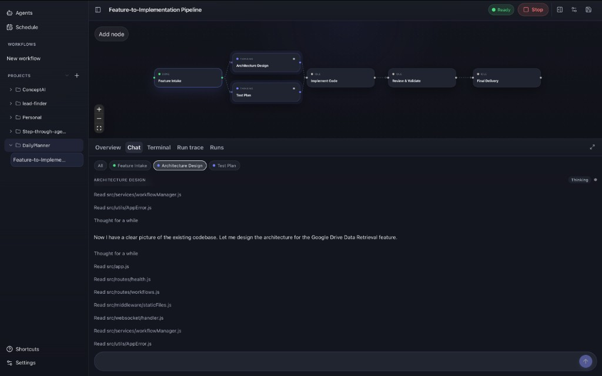
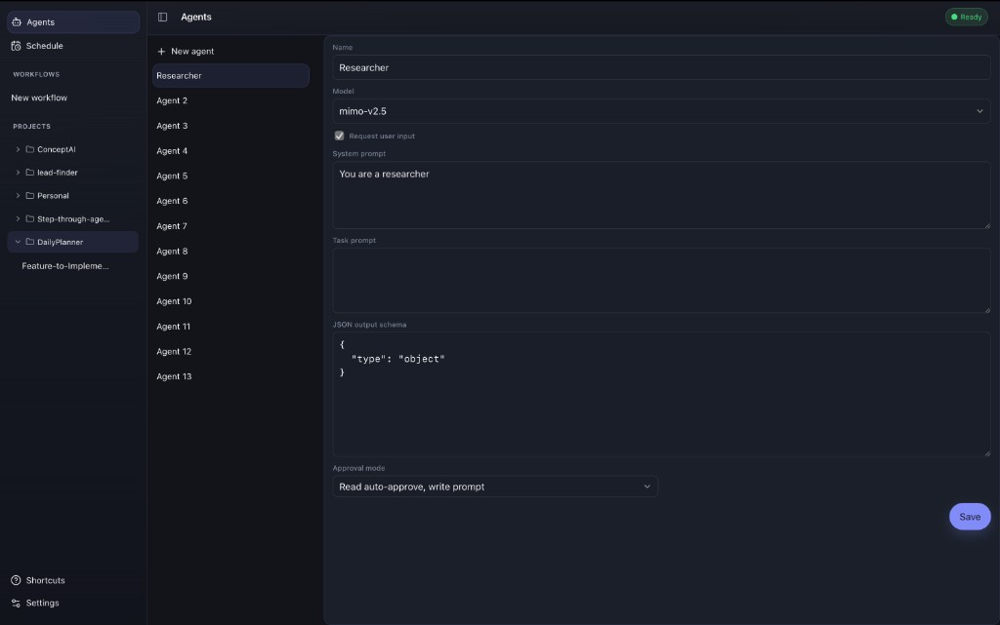
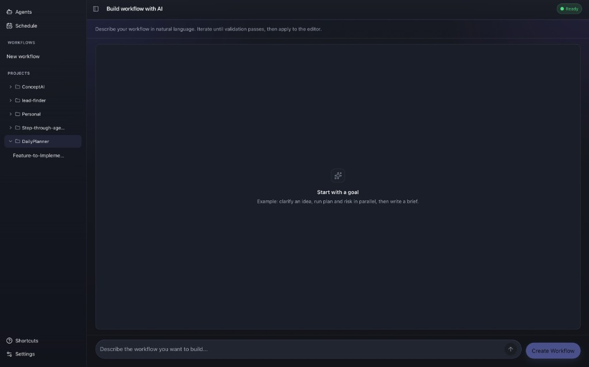

<p align="center">
  
</p>

<h1 align="center">OpenFlow</h1>

<p align="center">
  <strong>Compose and run AI agent workflows, visually.</strong><br/>
  A Rust desktop app for building DAG-based agent pipelines with tools, subagents, and live conversation.
</p>

<p align="center">
  <a href="LICENSE"></a>
  
  
  
</p>

<p align="center">
  <a href="#screenshots">Screenshots</a> ·
  <a href="#features">Features</a> ·
  <a href="#architecture">Architecture</a> ·
  <a href="#quick-start">Quick Start</a> ·
  <a href="#development">Development</a> ·
  <a href="#contributing">Contributing</a>
</p>

---

## Screenshots

<p align="center">
  
  <br/>
  <em>Run a multi-agent pipeline — parallel layers, live status, and per-node conversation.</em>
</p>

<p align="center">
  
  <br/>
  <em>Configure reusable agents — model, prompts, JSON schema, and tool approval.</em>
</p>

<p align="center">
  
  <br/>
  <em>Describe a workflow in natural language, iterate, then apply to the editor.</em>
</p>

## Features

<table>
<tr>
<td width="50%" valign="top">

### Visual workflow editor

Drag nodes onto a canvas, wire them into a DAG, and configure each agent in an inspector panel. Validation runs before every run: cycles and broken edges never reach execution.

</td>
<td width="50%" valign="top">

### Parallel agent layers

Nodes in the same topological layer run concurrently. Downstream agents receive upstream output automatically, with no manual plumbing.

</td>
</tr>
<tr>
<td width="50%" valign="top">

### Tools & subagents

Built-in filesystem, shell, and search tools with tiered approval policies. Nodes can invoke saved agents as subagents mid-run.

</td>
<td width="50%" valign="top">

### Multi-provider LLM support

OpenAI-compatible and Anthropic adapters behind a single `AiPort`. Swap models per node or override at the workflow level.

</td>
</tr>
<tr>
<td width="50%" valign="top">

### Project-aware persistence

Workflows live in the app store or in-repo under `.flow/workflows/`. Projects bind a repo path so agents run with the right working directory.

</td>
<td width="50%" valign="top">

### Interactive runs

Pause, resume, approve tools, and chat with individual nodes. Per-node conversation panels stream thinking, tool calls, and results in real time.

</td>
</tr>
</table>

## Architecture

OpenFlow uses nested hexagonal architecture: five layers, dependencies pointing strictly inward, enforced in CI.

```
┌─────────────────────────────────────────────────────────┐
│  UI (React + TypeScript)          crates/ui             │
├─────────────────────────────────────────────────────────┤
│  Desktop adapter (Tauri IPC)        crates/desktop      │
├─────────────────────────────────────────────────────────┤
│  Orchestration (runs, storage)      crates/orchestration│
├──────────────────────────┬──────────────────────────────┤
│  Engine (I/O-free core)  │  Providers (LLM transport)   │
│  crates/engine           │  crates/providers            │
└──────────────────────────┴──────────────────────────────┘
```

| Crate | Responsibility |
| --- | --- |
| **engine** | Workflow model, DAG validation, run state machine, ports |
| **orchestration** | Persistence, run coordination, tool execution, composition root |
| **providers** | OpenAI-compatible and Anthropic wire adapters |
| **desktop** | Tauri commands and IPC boundary |
| **ui** | Canvas, conversation panels, settings, workflow editor |

Deep dive: [`docs/architecture/technical-overview.md`](docs/architecture/technical-overview.md)

## Quick Start

### Prerequisites

- [Rust](https://rustup.rs/) (stable)
- [Node.js](https://nodejs.org/) 18+
- Platform build tools for [Tauri](https://v2.tauri.app/start/prerequisites/)

### Run

```bash
./scripts/start.sh
```

Installs dependencies on first run, then launches the desktop app.

### Install (macOS)

```bash
./scripts/install.sh
```

Builds a `.dmg` and opens it — drag **OpenFlow** to **Applications**.

> **macOS gatekeeper:** Unsigned local builds may be blocked on first launch. Right-click **OpenFlow** → **Open**, or run `xattr -cr /path/to/OpenFlow.app`.

## Development

```bash
# Full verification gate (fmt, clippy, test, arch, UI typecheck, …)
./scripts/verify.sh

# Frontend only (hot reload, no Tauri shell)
npm --prefix crates/ui run dev

# Frontend typecheck
npm --prefix crates/ui run typecheck

# Workflow acceptance tests
cargo test -p orchestration --test workflow_acceptance -- --nocapture
```

| Resource | Path |
| --- | --- |
| Repo map & change paths | [`AGENTS.md`](AGENTS.md) |
| Coding patterns | [`docs/contributing/coding-patterns.md`](docs/contributing/coding-patterns.md) |
| Testing workflows | [`docs/contributing/testing-workflows.md`](docs/contributing/testing-workflows.md) |
| Domain glossary | [`docs/glossary.md`](docs/glossary.md) |
| Layer contract | [`docs/architecture/contract.md`](docs/architecture/contract.md) |

## Contributing

See [`CONTRIBUTING.md`](CONTRIBUTING.md) for the PR checklist. Classify your change with [`docs/contributing/development-lanes.md`](docs/contributing/development-lanes.md), run `./scripts/verify.sh`, and update [`CHANGELOG.md`](CHANGELOG.md) for user-visible changes.

## License

[MIT](LICENSE)
