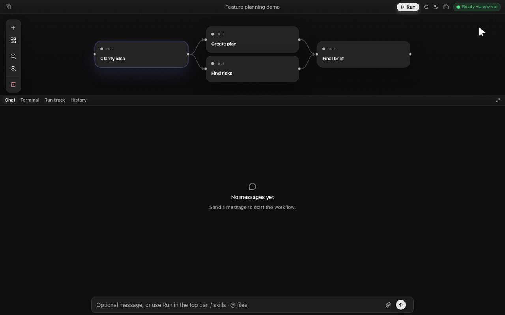

<p align="center">
  
</p>

<h1 align="center">OpenFlow: Visual AI Agent Workflow Builder</h1>

<p align="center">
  <strong>Open-source desktop IDE for building, running, and debugging multi-agent LLM workflows.</strong>
</p>

<p align="center">
  Design agent pipelines on a canvas. Orchestrate models, tools, subagents, human approvals, and MCP servers without hand-wiring prompts, provider SDKs, or state.
</p>

<p align="center">
  <a href="LICENSE"></a>
  
  
  
</p>

<p align="center">
  <a href="#visual-multi-agent-workflow-orchestration">Overview</a> ·
  <a href="#install">Install</a> ·
  <a href="#use-cases">Use cases</a> ·
  <a href="#features-for-ai-agent-workflows">Features</a> ·
  <a href="#supported-ai-model-providers">Providers</a> ·
  <a href="#developing">Developing</a> ·
  <a href="#contributing">Contributing</a>
</p>

## Visual multi-agent workflow orchestration

OpenFlow replaces hand-built prompt chains with a visual DAG editor and agent runtime. Drag AI agent nodes onto a canvas, connect their dependencies, configure prompts, providers, models, and tools, then watch the workflow execute in real time.

Each graph is an executable, repeatable LLM workflow. Independent agents run in parallel, downstream nodes receive upstream output, and explicit handoff artifacts move results through the pipeline.

Use OpenFlow like a Claude Code-style interactive agent session, with chat and tool approvals, or enable auto-approve for an autonomous run. Project workflows can live in Git under `.flow/workflows/`.

<p align="center">
  
</p>

<p align="center">
  <em>The middle agents run in parallel, then the final agent turns their results into a Markdown brief.</em>
</p>

## Install

Grab the latest build from [Releases](https://github.com/philbotar/OpenFlow/releases/latest) and open it. No Rust or Node required.

> **macOS Gatekeeper:** If macOS blocks the app on first launch, right-click **OpenFlow** → **Open**, or run `xattr -cr /path/to/OpenFlow.app`.

Want to build the installer yourself instead? See [Developing](#developing) below.

## Use cases

- **AI coding workflows** — connect planning, implementation, code review, testing, and release agents in one visible pipeline.
- **Parallel research** — fan work out across specialist agents, then merge their findings into one structured result.
- **Human-in-the-loop automation** — pause for questions or tool approval before an agent edits files or runs commands.
- **Multi-provider workflows** — route individual nodes through different hosted or local model providers.
- **Repeatable LLM pipelines** — version prompts, agent settings, graph structure, and project context alongside your code.

## Features for AI agent workflows

<table>
<tr>
<td width="50%" valign="top">

### Visual workflow editor

Drag nodes onto a canvas, wire them into a DAG, and configure each agent in an inspector panel. Validation runs before every run: cycles and broken edges never reach execution.

</td>
<td width="50%" valign="top">

### Parallel agent layers

Nodes in the same topological layer run concurrently. Downstream agents receive upstream output automatically, with no manual plumbing.

</td>
</tr>
<tr>
<td width="50%" valign="top">

### Tools & subagents

Agents can read and edit files, run shell commands, search code or the web, call MCP tools, and delegate to saved subagents. Approval policies gate sensitive actions.

</td>
<td width="50%" valign="top">

### Multi-provider LLM support

Choose a provider and model per node. Mix hosted APIs, ChatGPT OAuth, Amazon Bedrock, local Ollama or LM Studio, and custom OpenAI-compatible endpoints in one workflow.

</td>
</tr>
<tr>
<td width="50%" valign="top">

### Durable context

Attach images, keep workflows beside project code, and preserve run-owned context across replies, retries, checkpoint resume, and replay.

</td>
<td width="50%" valign="top">

### Interactive or autonomous runs

Chat with individual agents, inspect streamed reasoning and results, and approve tools as they run. Or enable auto-approve and let dependency-ready work finish unattended.

</td>
</tr>
</table>

## Supported AI model providers

Built-in profiles: **OpenAI**, **Anthropic**, **ChatGPT (Codex)**, **Amazon Bedrock**, **OpenRouter**, **Groq**, **Together AI**, **Fireworks AI**, **DeepSeek**, **xAI / Grok**, **Mistral AI**, **Perplexity**, and **Gemini**.

Run local models through **Ollama** or **LM Studio**. Connect other gateways with a custom OpenAI-compatible endpoint.

See the [provider setup guide](docs/guides/provider-setup.md) for auth, endpoints, model selection, and the full compatibility matrix.

## Developing

Making changes to OpenFlow itself? Build and run it from source.

### Prerequisites

- [Rust](https://rustup.rs/) (stable)
- [Node.js](https://nodejs.org/) 18+
- Platform build tools for [Tauri](https://v2.tauri.app/start/prerequisites/)

### Run in dev mode

```bash
./scripts/start.sh
```

The first run installs the dependencies. After that, the script starts the desktop app with hot reload.

### Build an installer

```bash
./scripts/install.sh
```

On macOS, this builds and opens a `.dmg`. Drag **OpenFlow** to **Applications**.

### Other useful commands

```bash
# Full verification gate (fmt, clippy, test, arch, UI typecheck, …)
./scripts/verify.sh

# Frontend only (hot reload, no Tauri shell)
npm --prefix crates/ui run dev

# Frontend typecheck
npm --prefix crates/ui run typecheck

# Workflow acceptance tests
cargo nextest run -p orchestration --test workflow_acceptance --no-capture
```

| Resource | Path |
| --- | --- |
| New users — feature map & first hour | [`docs/guides/for-new-users.md`](docs/guides/for-new-users.md) |
| Install, provider, first workflow | [`docs/getting-started/README.md`](docs/getting-started/README.md) |
| Repo map & change paths | [`AGENTS.md`](AGENTS.md) |
| Architecture overview | [`docs/architecture/technical-overview.md`](docs/architecture/technical-overview.md) |
| Coding patterns | [`docs/contributing/coding-patterns.md`](docs/contributing/coding-patterns.md) |
| Testing workflows | [`docs/contributing/testing-workflows.md`](docs/contributing/testing-workflows.md) |
| Example workflows | [`examples/README.md`](examples/README.md) |
| Domain glossary | [`docs/glossary.md`](docs/glossary.md) |

## Contributing

See [`CONTRIBUTING.md`](CONTRIBUTING.md) for the PR checklist.

Classify your change with [`docs/contributing/development-lanes.md`](docs/contributing/development-lanes.md), run `./scripts/verify.sh`, and update [`CHANGELOG.md`](CHANGELOG.md) for user-visible changes.

## License

[MIT](LICENSE)
