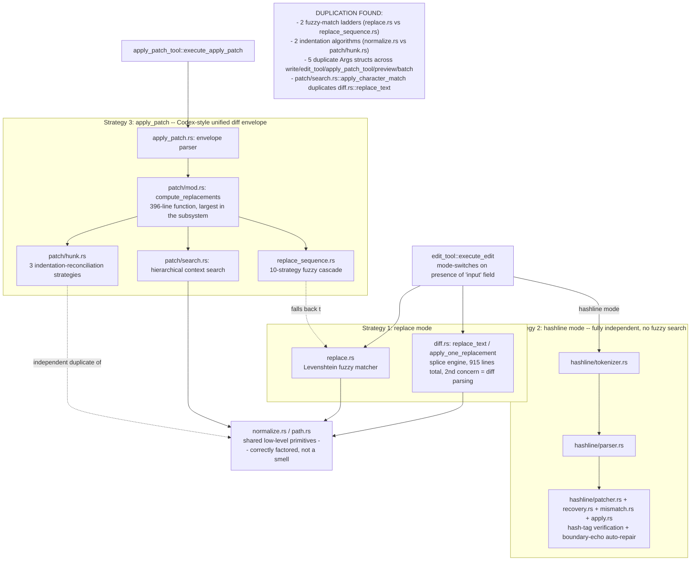

# OpenFlow Refactor Audit (discovery only, no code changed)

Generated 2026-07-02 on branch `bedrock-sso-fix`, by 8 parallel read-only audits covering every file in `crates/` (~65k lines: ~44k Rust, ~22k TS/TSX). Nothing was edited. This is the input for a follow-up pass that decides what to actually do.

## Implementation progress

Updated 2026-07-02 during the follow-up refactor pass.

Completed:

- Fixed the provider usage-report bug from cross-cutting finding #1 for Anthropic-direct and Bedrock runs. Anthropic responses now attach usage reports, Bedrock non-streaming responses attach usage reports, and Bedrock streaming aggregates metadata usage into `UsageReport`.
- Removed the providers dead code listed in section 3: `OpenAiClient`, `OpenAiClientConfig`, `OpenAiWireApi`, `AiClient::new`, `AiClientConfig::openai`, `AnthropicConfig::default_base`, and `AuthConfig::has_key`.
- Removed the orchestration dead code listed in section 3 for `greeting/model.rs`, `template_store.rs`, `stage_file`, `restore_file`, `ReadSelector::Conflicts`, `ProviderProfile::openai_default`, `AppSettings::active_profile_mut`, `AppSettings::active_models`, `AppSettings::provider_display_order`, `AuthoringError::is_session_not_found`, `RunCoordinator::runtime_handle`, `ToolPortImpl::emit_tool_updated`, and `AppBackend::with_default_paths`.
- Verified `AppBackend::load_projects()` is not dead in the current tree; it is still covered by `backend::tests::load_projects`.
- Trimmed orchestration edit-tool dead internals listed in section 3: removed unused hashline regex fragments, mismatch helpers, tokenizer helpers, `PatchSection::apply_partial_to`, and unused warning constants; moved test-only `assert_editable_file_content` and `write_text_create` behind `#[cfg(test)]`.
- Trimmed the orchestration crate-root re-exports listed in section 3 for raw `CallableAgent`, root `LspSettings`, and root `ProviderProfile`; left `orchestration::lsp` because current code uses that path.
- Removed two standalone orchestration re-export modules from section 4: `run/execution/subagents.rs` is now imported directly from `engine`, and `adapters/tool_impl/errors.rs` is now an inline shim in `tool_impl/mod.rs`.
- Flattened two single-file orchestration modules from section 4 without changing public module paths: `terminal/mod.rs` moved to `terminal.rs`, and `run/state/mod.rs` moved to `run/state.rs`.
- Removed the standalone `agent/ports.rs` file from section 4 by moving `AgentStore` into `agent.rs` and updating orchestration callers to use `crate::agent::AgentStore`.
- Flattened the remaining `agent/` directory from section 4 into `agent.rs`; `AgentLibrary` and `AgentStore` now live together in the flat module.
- Removed the standalone engine `execution/retry.rs` file from section 4 by inlining its single private helper into `interactive_engine/completion.rs`.
- Folded engine `tools/edit_batch.rs` into `tools/file_change.rs` while preserving the existing public re-exports for `EditBatch` and `FileSnapshot`.
- Removed the engine public-API inbound port scaffolding from section 3: deleted `ports/inbound.rs`, removed the unused `InteractiveEngine` trait impls, updated docs to point at `on_human_input` / `on_tool_decision`, and regenerated `crates/engine/tests/snapshots/public_api.txt`.
- Removed the UI onboarding storage duplicate from section 4 by switching `AppProvider` to the shared `storedBoolean` helper and deleting `context/appProvider/onboardingStorage.ts`.
- Flattened the 14 single-component UI folders from section 4 into `crates/ui/src/components/*.tsx`, removed their one-line barrels, and normalized the component barrel to export `PickerModal`.
- Removed the UI `port.ts` passthrough from cross-cutting finding #8 / section 4; UI code and tests now use `api.ts` wrappers directly.
- Collapsed `SidebarIcon` copy-paste match blocks from section 5 into a typed icon lookup table with one render path.
- Extracted the non-trivial desktop run-event bridge from section 5 out of `crates/desktop/src/lib.rs` into `run_event_bridge.rs`; `lib.rs` now keeps the Tauri command/event wiring.
- Extracted desktop schedule polling/status emission from `crates/desktop/src/lib.rs` into `schedule_events.rs`; workflow command handlers still call the same status emission helper.
- Extracted desktop terminal event forwarding from `crates/desktop/src/lib.rs` into `terminal_events.rs`; `start_terminal` now only starts the backend terminal, spawns the bridge, and returns the session.
- Extracted desktop window-close cleanup from `crates/desktop/src/lib.rs` into `app_lifecycle.rs`; the Tauri builder now delegates close events to a focused lifecycle helper.
- Moved desktop app setup from the inline Tauri builder closure into `app_lifecycle::setup_app`; runtime handle injection, sleep guard registration, schedule loop startup, and debug devtools setup now live with lifecycle code.
- Moved desktop-only IPC payload/error types from `crates/desktop/src/lib.rs` into `ipc_types.rs`; command handlers now import `BootstrapPayload` and `CommandError`.
- Removed the UI dead/export-only helpers listed in section 3: `withoutNodeRemovals`, `selectionIdsFromChange`, and `shouldEmitSelectionChange`; moved `createEmptyToolConfig` to `lib/workflow/testHelpers.ts` so it no longer lives in the production workflow helper surface.
- Updated docs that referenced removed template-store and `with_default_paths` code.
- Updated `crates/workspace-checks/arch-check-rules.toml` so the existing `ReasoningEffortOption` import in orchestration passes the architecture check.
- Deduplicated run launch paths in `RunCoordinator` via shared `finalize_run_launch` in `run/coordinator/session.rs` (covers `start_run`, `continue_run`, `resume_durable_run`).
- Removed duplicate `AppBackend::load_projects()` (`list_projects` already delegates to the same registry path).
- Split desktop Tauri commands from `lib.rs` into `commands/{bootstrap,project,workflow,agent,settings,authoring,run,git,terminal}.rs`; `lib.rs` is now builder + handler registration only.
- Made `subagents_for_node` private in engine (test-only public API trim).
- Split `AppProvider.tsx` god-context into `context/appProvider/`: `shared.ts` + 8 hooks (`useAppShell`, `useSettings`, `useWorkspaceCatalog`, `useWorkflowEditor`, `useRunSession`, `useChatComposer`, `useDock`, `useWorkflowAuthoring`) composed by thin `useAppProviderState.ts`; `AppProvider.tsx` is now a 7-line context wrapper. `AppContextValue` unchanged.
- Split `backend::AppBackend` facade into domain modules: `workflow.rs`, `agents.rs`, `projects.rs`, `settings.rs`, `authoring.rs`, `runs.rs`, `schedule.rs`, `terminal.rs`, `helpers.rs`; `mod.rs` is now composition root (~117 lines). Public `AppBackend` API unchanged.
- Unified provider response-parsing tail in `mapping.rs`: `resolve_tool_turn_outcome` + `NoToolCallsPolicy` / `ResolveToolTurnParams` shared by `parse_chat_completion_output`, `parse_responses_output`, `anthropic.rs`, and `bedrock.rs` (empty-turn recovery, internal-tool routing, external batch invariant).
- Deduplicated edit-tool wire args and fuzzy env settings: `tool_args.rs` (`WriteToolArgs`, `EditToolArgs`, `EditEntry`, `PatchEnvelopeArgs`, `ToolPathArg`) and `fuzzy_settings.rs` (`allow_fuzzy`, `edit_fuzzy_threshold`, `patch_fuzzy_threshold`) shared by `write`, `edit_tool`, `apply_patch_tool`, `preview`, and `batch`.
- Consolidated edit-tool fuzzy/indent primitives: shared `is_dominant_fuzzy_match`, `fuzzy_sequence_score_at`, `fuzzy_line_starts_with`, `fuzzy_line_partial_includes` in `replace.rs` (used by `replace_sequence.rs` + `find_match`); shared `apply_indent_delta_line` + `detect_indent_char_from_lines` in `normalize.rs` (used by `patch/hunk.rs`).
- Split large edit-tool files: `text_replace.rs` (fuzzy splice engine from `diff.rs`), `patch/replacements.rs` (`compute_replacements` + apply helpers from `patch/mod.rs`), `hashline/boundary_repair.rs` (replacement echo repair from `hashline/apply.rs`).
- Trimmed engine public API (section 3): internal-only symbols moved off crate-root re-exports (`pub(crate)` / private-module `pub` + `pub(crate) use`); removed `NodeToolConfig::is_enabled` stub; `Template` field-lock helpers and `build_adhoc_subagent_summaries` / `collect_checkpoint_node_ids` no longer public; regenerated `crates/engine/tests/snapshots/public_api.txt` (8137 lines).
- Merged `adjust_lines_indentation` into `normalize.rs` (delegates to `adjust_indentation` + patch overlay); removed ~280 lines from `patch/hunk.rs`; added spaces→tabs path to `adjust_indentation`.
- Deduplicated node-terminal prologue in `run/execution/events.rs` (`clear_node_session_focus`, `record_node_failure`); merged `NodeErrored`/`NodeFailed` arms.
- Extracted shared tool retry path in `tool_port.rs` (`run_registered_tool_with_retry`, `emit_tool_retrying`).
- Split `lib/workflow/index.ts` into `layout.ts`, `reasoning.ts`, `clone.ts`, `runState.ts`, `canvas.ts`, `chatLayout.ts` (barrel unchanged); trimmed internal-only dock-geometry exports from `lib/utils/index.ts`.
- Deduplicated provider resolution fallback chain in `settings/provider.rs` (`first_trimmed_string`, `env_trimmed_string`).
- Trimmed UI export surface: `summarizeDiffFiles`, `UI_ZOOM_STEP` no longer public.
- Extracted Bedrock AWS error mapping to `providers/src/bedrock_errors.rs`; updated `threading-concurrency.md` run-state listener paths.

Verification already run during the follow-up pass:

- `cargo test -p providers`
- `cargo clippy -p providers --all-targets -- -D warnings`
- `cargo test -p orchestration read::`
- `cargo test -p orchestration tool_impl::edit`
- `cargo test -p orchestration --lib`
- `cargo test -p engine`
- `cargo clippy -p engine -- -D warnings`
- `cargo test -p desktop`
- `cargo clippy -p desktop -- -D warnings`
- `./scripts/check-engine-public-api.sh`
- `./scripts/check-architecture.sh`
- `npm --prefix crates/ui run typecheck`
- Focused UI Vitest runs for workflow, schedule, canvas, API, workflow settings, and project folder tests
- Focused UI Vitest runs for `AppHeader`, `TextSelect`, and `EditorScreen`
- Focused UI Vitest runs for `App`, `ToolApprovalCard`, `Message`, `api`, `GitPanel`, and `AboutSection`
- Focused UI Vitest runs for `AppHeader`, `SidebarNavButton`, `ProjectFolderRow`, and `App`
- Full UI Vitest suite: `npm --prefix crates/ui test` (31 files, 313 tests)
- `cargo fmt --all`


- Split `mapping.rs` wire parsers into `mapping/wire_output.rs` (`parse_responses_output`, `parse_chat_completion_output`, `parse_compatible_tool_call`, `extract_chat_message_text`).
- Split `WorkflowCanvas.react.tsx` into `workflowCanvasGraph.ts` (pure reconciliation/build helpers), `workflowCanvasViewport.tsx` (`CanvasViewportController`), and a slim component shell.
- Split `FirstRunOnboarding` slide/mock components into `onboardingSlides.tsx`; shell stays in `FirstRunOnboarding.tsx`.
- Updated `docs/ROADMAP.md` AppProvider path drift to `appProvider/` hooks.

Still open:

- Commit + PR (user request only).
- `FirstRunOnboarding.css` (~1001 lines) — optional CSS split deferred; TS structure is split.
- Residual `lib/types` mirror exports are intentional IPC DTO surface; no further trim without breaking the desktop seam contract.


## How to read this

- **Section 1**: two mermaid diagrams — macro architecture/call-tree, and a zoom-in on the one subsystem too tangled to draw at the macro level.
- **Section 2**: 8 cross-cutting findings that matter more than any single file (duplication patterns, 2 real bugs found along the way, an architecture fact worth knowing before touching the frontend).
- **Sections 3-5**: the three buckets asked for — dead code, files that don't need to be standalone, files/functions that are too large or complex — each grouped by crate, in dependency order (engine → providers → orchestration → desktop → ui).
- **Section 6**: caveats for whoever executes this.

Every item below has a file path (and line number where useful) so it can be jumped to directly. "Confidence" isn't marked per-line; anything under Dead Code was verified by a repo-wide grep for callers, not guessed from naming.

---


## 1. Diagrams


### 1a. Macro architecture / call-tree

```mermaid
flowchart TB
    subgraph UI["crates/ui — SolidJS app + 1 React island"]
        direction TB
        AppTsx["App.tsx: root + ScreenRouter"]
        AppProvider["AppProvider.tsx -- 2501 lines\nGOD CONTEXT: 9 tangled concerns"]
        AppContext["AppContext.tsx -- 150+ member interface"]
        Presentation["screens/ -> panels/ -> components/\n89 files, SolidJS"]
        CanvasHost["canvas/WorkflowCanvasHost.tsx\nSolid component that mounts a React root"]
        CanvasReact["canvas/WorkflowCanvas.react.tsx -- 645 lines\nREACT ISLAND via xyflow/react"]
        ApiTs["api.ts -- 458 lines, 72 flat invoke wrappers"]
        PortTs["port.ts -- 236 lines\n1:1 passthrough of api.ts, no real payoff"]

        AppTsx --> AppProvider
        AppProvider --> AppContext
        AppContext --> Presentation
        Presentation --> CanvasHost
        CanvasHost --> CanvasReact
        AppProvider --> PortTs
        PortTs --> ApiTs
        Presentation -.4 files bypass context, call port.ts directly.-> PortTs
    end

    subgraph Desktop["crates/desktop -- Tauri shell"]
        LibRs["lib.rs -- 970 lines\n66 tauri command fns, flat, no submodules"]
    end

    subgraph Orchestration["crates/orchestration -- 149 files / 37.8k lines"]
        Backend["backend::AppBackend -- 803 lines\nGOD FACADE: 10 unrelated bounded contexts"]
        RunCoord["run::coordinator::RunCoordinator -- 915 lines\n3 near-duplicate launch methods"]
        Drive["run::execution::drive\nonly driver of engine InteractiveEngine"]
        AiAdapter["run::execution::ai_adapter.rs\nimplements engine AiPort"]
        ToolPortNode["run::execution::tool_port.rs -- 648 lines\nimplements engine ToolPort; tangled"]
        ToolReg["tool::registry + tool::runner/dispatch"]
        ToolImpl["adapters::tool_impl::edit\n3 PARALLEL EDIT STRATEGIES -- see diagram 1b"]
        Adapters["adapters::storage / mcp / infrastructure"]
        Domain["workflow/ schedule/ settings/ project/ terminal/\n+ dead greeting/ module"]

        Backend --> RunCoord
        Backend --> Domain
        RunCoord --> Drive
        Drive --> AiAdapter
        Drive --> ToolPortNode
        ToolPortNode --> ToolReg
        ToolReg --> ToolImpl
        Drive --> Adapters
    end

    subgraph Providers["crates/providers"]
        Client["client::AiClient -- provider dispatch"]
        Anthropic["anthropic.rs\nown parser: no usage tracking, no tool-call grouping"]
        Bedrock["bedrock.rs -- 1021 lines\nown parser: no usage tracking"]
        OpenAICompat["openai_compat.rs -- thin, delegates correctly"]
        Mapping["mapping.rs -- 1125 lines\nshared response-parsing, OpenAI path only"]

        Client --> Anthropic
        Client --> Bedrock
        Client --> OpenAICompat
        OpenAICompat --> Mapping
    end

    subgraph Engine["crates/engine -- base layer"]
        IE["execution::interactive_engine::InteractiveEngine\nsubagent-agnostic core loop"]
        Graph["graph:: Workflow/Node/validate_workflow"]
        PortsOut["ports::outbound -- AiPort, ToolPort -- LIVE"]
        PortsIn["ports::inbound -- HumanInputPort, ToolApprovalPort\nDEAD: 0 callers, bypassed by inherent methods"]

        IE --> Graph
        IE --> PortsOut
    end

    ApiTs -- "invoke(), 66 commands" --> LibRs
    LibRs --> Backend
    AiAdapter --> Client
    IE -. "AiPort" .-> AiAdapter
    IE -. "ToolPort" .-> ToolPortNode
    Drive --> IE
```


### 1b. Zoom-in: the `adapters::tool_impl::edit` subsystem (3 parallel edit strategies)

The single most tangled part of the codebase — three genuinely-different LLM-facing edit tools that independently reinvented the same generic primitives.




---


## 2. Cross-cutting findings (read this before the lists)

1. **Provider response-parsing is duplicated 4 ways and it already caused 2 real bugs.** `mapping.rs` has shared parsers used only by `openai_compat.rs`. `anthropic.rs` and `bedrock.rs` each hand-roll their own, copy-pasting the same "collect text+tool_calls → fallback → enforce single-tool-call invariant" control flow (`mapping.rs:607-625,694-712`, `anthropic.rs:237-254`, `bedrock.rs:392-409`). Consequences: **(a)** `UsageReport`/token-usage tracking is OpenAI-only — the context-window UI indicator is silently empty for Anthropic-direct and Bedrock runs. **(b)** `bedrock.rs` groups consecutive tool-call/tool-result messages per Bedrock's requirements; `anthropic.rs` does not, which looks like it would violate Anthropic's strict user/assistant alternation on a parallel-tool-call turn — untested either way, worth a live check before trusting it. Given this is on the `bedrock-sso-fix` branch, this is probably the most actionable finding in the whole audit.
2. **Three parallel edit-tool implementations in** `adapters::tool_impl::edit` (replace / hashline / apply_patch) are individually justified by different LLM-facing grammars, but each reinvented fuzzy-line-matching and indentation-reconciliation from scratch, and 5 near-identical `Args` structs exist across `write.rs`/`edit_tool.rs`/`apply_patch_tool.rs`/`preview.rs`/`batch.rs`. See diagram 1b.
3. `context/AppProvider.tsx` **(2501 lines) is a single god-context for the entire frontend** — 31 signals, 21 memos, 13 effects, 80 `handle`* functions, 9 tangled concerns (workspace data, run lifecycle, chat, workflow authoring, settings, terminal, schedule, shell/chrome UI, cross-cutting toasts), exposed through one 150+-member context object that every component depends on. The state itself is reasonably namespaced; what's tangled is the handler/orchestration layer. Full 8-hook split proposed in the ui-state slice notes. Single biggest refactor opportunity in the repo.
4. `desktop/src/lib.rs` **(970 lines) is 66** `#[tauri::command]` **functions flat in one file**, no submodules. All 66 are registered and all 66 are called from the frontend (no dead commands here) — this is pure organization debt. Natural grouping mirrors orchestration's own modules almost 1:1 (workflow/schedule/agent/run/project/terminal/git/provider/authoring/settings).
5. `backend::AppBackend` **(803 lines) is a god-facade spanning 10 unrelated bounded contexts** (workflow, agents, projects, settings, debug logging, MCP, workflow-authoring chat, run coordination, terminal, scheduling) behind one struct — forced by Tauri needing one managed state type, not by the logic itself.
6. `run::coordinator::mod.rs` **has 3 near-duplicate run-launch methods** (`start_run`, `continue_run`, `resume_durable_run`) sharing an identical skeleton (validate → prepare → terminate active → build resources → spawn → attach handles), differing only in where resources are sourced from.
7. **The frontend is SolidJS, not React**, despite `react`/`react-dom` sitting in `package.json` and despite the natural assumption from file extensions. Only 2 files (`canvas/WorkflowCanvas.react.tsx`, `canvas/WorkflowNode.react.tsx`) are React, used solely because `@xyflow/react` has no Solid equivalent; `WorkflowCanvasHost.tsx` manually mounts a `react-dom/client` root inside a Solid component and re-renders it on every Solid reactive tick. This is architecturally load-bearing context for anyone refactoring the UI layer — it's why the canvas subtree can't call `useAppContext()` (a Solid context) and gets everything via props instead.
8. `port.ts` **(236 lines) is a fully hand-maintained pass-through** mirroring 72 of `api.ts`'s 75 exports 1:1 with zero behavioral difference and exactly one implementation ever — tests already mock `api.ts` directly instead of using it. It exists to give tests something to mock, but that job is already done elsewhere. Candidate for deletion (call `api.ts` directly, as 3 files already do for the functions `port.ts` excludes).

---


## 3. Dead code

Verified by repo-wide grep for callers, not by naming. Items marked **(whole file/module)** are entirely unreferenced, not just individual functions.

### engine

- ~~`crates/engine/src/ports/inbound.rs` **(whole file)**~~ — **done** (deleted; inherent resume methods only).
- ~~`crates/engine/src/template/mod.rs:58,69,73,77`~~ — **done** (`pub(crate)`; test-only).
- ~~`crates/engine/src/tools/config.rs:42` — `NodeToolConfig::is_enabled`~~ — **done** (removed).
- ~~`crates/engine/src/execution/subagents.rs:50` — `subagents_for_node`~~ — **done** (private).
- ~~`lib.rs` re-export audit~~ — **done** (internal symbols off root API; snapshot regenerated). `CheckpointError` / `EngineInputError` stay public on inherent-method signatures; dropped from `engine::` root re-exports only.


### providers

- `crates/providers/src/lib.rs:34-36` — `OpenAiClient`, `OpenAiClientConfig`, `OpenAiWireApi` (type aliases) — zero references, leftover from a pre-multi-provider era.
- `crates/providers/src/client.rs:93` — `AiClient::new(api_key)` — zero call sites; real construction goes through `AiClient::with_config`.
- `crates/providers/src/client.rs:53` — `AiClientConfig::openai(api_key)` — only caller is the also-dead `AiClient::new`.
- `crates/providers/src/client.rs:21` — `AnthropicConfig::default_base()` — zero call sites; callers build the struct literal directly instead.
- `crates/providers/src/auth.rs:24` — `AuthConfig::has_key()` — zero call sites; the one place that needs this logic reimplements it inline instead of calling it.


### orchestration

- `crates/orchestration/src/greeting/` **(whole module)** — `Greeting` struct + 5 tests, 76 lines. Not declared via `mod` anywhere in `lib.rs` — never enters the compilation graph at all, so its own tests never run. Zero risk to delete.
- `crates/orchestration/src/adapters/storage/template_store.rs` **(whole file, 321 lines)** — `FileTemplateStore` fully implements `engine::TemplateStore` (with migration + corruption recovery + 8 tests) but is never constructed anywhere; `backend/mod.rs` (the DI root) has zero references to "template."
- `crates/orchestration/src/adapters/infrastructure/git/mod.rs:58,64` — `stage_file`, `restore_file` — zero callers, unlike their siblings which are all wired to Tauri commands.
- `crates/orchestration/src/tool/read/selector.rs:6,30-31` + `render.rs:9` — `ReadSelector::Conflicts` — reachable only via an undocumented `:conflicts` magic suffix not advertised in the tool's JSON schema; likely a remnant of a removed feature.
- `crates/orchestration/src/settings/model.rs:116,366,373,378` — `ProviderProfile::openai_default()`, `AppSettings::active_profile_mut()`, `active_models()`, `provider_display_order()` — zero call sites.
- `crates/orchestration/src/workflow/authoring/error.rs:22` — `AuthoringError::is_session_not_found()` — zero call sites; real code matches the enum variant directly instead.
- `crates/orchestration/src/run/coordinator/mod.rs:837` — `RunCoordinator::runtime_handle()` — `#[allow(dead_code)]` with a stale "used by integration tests" reason; zero actual callers.
- `crates/orchestration/src/run/execution/tool_port.rs:424-425` — `ToolPortImpl::emit_tool_updated()` — `#[allow(dead_code)]` scaffolding for a feature that appears to have never landed.
- `crates/orchestration/src/backend/mod.rs:327` — `AppBackend::load_projects()` — orphaned earlier variant of the actually-used `list_projects()`.
- `crates/orchestration/src/backend/mod.rs:110` — `AppBackend::with_default_paths()` — zero callers despite being documented as a helper in `docs/architecture/threading-concurrency.md` (docs/code have drifted).
- Deep in `adapters::tool_impl::edit` (see diagram 1b subsystem) — `hashline/format.rs:24-29` (5 unused regex-fragment consts), `hashline/mismatch.rs:40,96,166` (`parse_tag`, `display_message`, `validate_line_ref`), `hashline/input.rs:363,388` (`PatchSection::apply_to`, `apply_partial_to`), `hashline/messages.rs:17,19,25` (3 unused warning consts), `hashline/tokenizer.rs:552,570,574` (`tokenize_all`, `is_header`, `is_envelope_marker`), `auto_generated.rs:131` (`assert_editable_file_content`, test-only), `io.rs:305` (`write_text_create`, test-only).
- `lib.rs` re-export audit: `engine::CallableAgent` (line 33) duplicates the `AgentDefinition` alias one line above with zero use of the raw name; `Template`/`TemplateStore`/`TemplateStoreError`, `adapters::infrastructure::lsp`, and `settings::ports::{LspSettings, ProviderProfile}` all have zero desktop consumers via the crate-root path (`LspSettings` is separately re-exported at `orchestration::lsp::LspSettings`, which is the path actually used).


### desktop

- All 66 `#[tauri::command]` functions in `lib.rs` are confirmed registered and confirmed called from the frontend — **no dead commands.**


### ui

- `crates/ui/src/canvas/WorkflowCanvas.react.tsx:377-381,419-426,428-436` — `withoutNodeRemovals`, `selectionIdsFromChange`, `shouldEmitSelectionChange` — exported and unit-tested, but zero production call sites; apparent leftovers of an earlier `onSelectionChange`-based implementation that was replaced by `onNodeClick`/`onEdgeClick`/`onPaneClick`.
- `crates/ui/src/lib/workflow/index.ts:164` — `createEmptyToolConfig` — used only by 7 test files, zero production call sites.
- ~25 more exported symbols across `lib/types/index.ts` (21 backend-struct mirror types — lowest severity, likely intentional), `lib/workflow/index.ts` (6 logic helpers), `lib/utils/index.ts` (6 dock-geometry consts), `lib/projects/index.ts`, `lib/diff/index.ts`, `lib/fileReferences/index.ts`, `lib/chatCommands/index.ts`, `lib/motion/index.ts`, `lib/theme/index.ts`, `lib/uiZoom/index.ts`, `api.ts`, `port.ts`, `context/appProvider/onboardingStorage.ts` — all "used within their own file but never imported elsewhere," full list with line numbers in the ui-state slice detail. Treat as export-surface trims, not deletions.

---


## 4. Files/modules that don't need to be standalone


### orchestration

- `crates/orchestration/src/agent/` (3 files, 101 lines total) — 8x smaller than every sibling top-level module. The crate's own convention for this exact shape (a `Store` port + a `Catalog`/`Library` wrapper) is to keep them as peer files inside an existing domain directory, not a dedicated top-level one (cf. `workflow/ports.rs` + `workflow/catalog.rs`). Fold into a flat `agent.rs`, or merge into `workflow/`.
- `crates/orchestration/src/greeting/` — dead (see §3) *and* structurally odd even if it weren't: the only directory in the crate whose single file isn't named to match the dir. Delete outright.
- `crates/orchestration/src/terminal/mod.rs` (229 lines, only file in `terminal/`) — one of only 2 single-file, zero-subdirectory modules in the crate (the other being `greeting/`). Flatten to `src/terminal.rs` to match the crate's own convention (`api.rs`, `error.rs`, `diagnostics.rs` sit flat).
- `crates/orchestration/src/run/state/` (1 file, 209 lines) — same pattern, only single-file subdir among `run/`'s three. Flatten to `run/state.rs`.
- `crates/orchestration/src/run/execution/subagents.rs` (4 lines) — pure re-export barrel, one consumer (`tool_port.rs`). Inline and delete.
- `crates/orchestration/src/agent/ports.rs` (7 lines) — one trait, one consumer in the same directory.
- `crates/orchestration/src/adapters/tool_impl/errors.rs` (1 line) — a single `pub use`; `tool_impl/mod.rs` already has an identical re-export-shim pattern this could join.
- `crates/engine/src/execution/retry.rs` (16 lines) — one function, one caller in the whole repo. Inline into `completion.rs`.
- `crates/engine/src/tools/edit_batch.rs` (24 lines) — two plain structs, no functions; could live in a sibling file. Soft candidate.


### ui

- **14 of** `components/`**'s ~20 subdirectories are exactly one component file + a 1-line barrel**, no colocated styles/hooks: `AnimatedModal/`, `CollapsibleSection/`, `InspectorSection/`, `NodePickerModal/`, `PanelEmptyState/`, `PickerModal/`, `ScheduleTimePickerModal/`, `ScheduleWorkflowPickerModal/`, `ShortcutsModal/`, `SidebarIcon/`, `Spinner/`, `WorkflowPickerModal/`, `AppHeader/`, `TextSelect/`. Only `FirstRunOnboarding/` earns its folder (a 1001-line colocated CSS file). All 14 could flatten to `components/ComponentName.tsx` — mechanical, low-risk. Most trivial: `CollapsibleSection.tsx` (12 lines), `Spinner.tsx` (20 lines), `PanelEmptyState.tsx` (33 lines).
- `crates/ui/src/context/appProvider/onboardingStorage.ts` (9 lines) — reimplements the exact pattern `lib/storedBoolean/index.ts` already provides generically. Delete, replace 2 call sites with the generic helper.
- `crates/ui/src/port.ts` (236 lines) — see cross-cutting finding #8. Functionally trivial despite line count; candidate for deletion.
- `components/index.ts` barrel is inconsistently curated (re-exports the never-externally-used `AnimatedModal`, omits the 3-times-used `PickerModal`) — worth normalizing alongside any flattening pass.

---


## 5. Files/functions that are too large or complex

Ranked roughly by impact. "Tangled" = genuinely mixes unrelated concerns; "flat" = long but a repetitive/mechanical list (lower priority to split).

1. `crates/ui/src/context/AppProvider.tsx` **— 2501 lines. TANGLED.** See cross-cutting finding #3 for the full 9-concern breakdown and proposed 8-hook split.
2. `crates/orchestration/src/adapters/tool_impl/edit/patch/mod.rs` **— 883 lines.** `compute_replacements` (138-533) is a single **396-line function** — the largest in the repo — interleaving hunk-hint resolution, 3-tier context-anchor search, and ambiguity/overlap error formatting. TANGLED.
3. `crates/ui/src/lib/workflow/index.ts` **— 1067 lines.** Kitchen-sink bundling 7 sub-domains (DAG layout, deep-clone helpers, provider/reasoning-effort rules, run-state tracking, canvas-graph projections, chat-transcript layout engine, misc predicates), no internal section markers. TANGLED.
4. `crates/providers/src/mapping.rs` **— 1125 lines (~725 production / ~400 test).** Mixes tool-spec building, JSON-repair heuristics, and two full wire-format converters. `parse_responses_output` (111 lines) and `parse_chat_completion_output` (86 lines) both nested match-in-match. See cross-cutting finding #1.
5. `crates/orchestration/src/backend/mod.rs` **— 803 lines.** God-facade, 10 bounded contexts, ~70 pub methods. Breadth not depth (every method 1-15 lines) — see cross-cutting finding #5.
6. `crates/orchestration/src/run/coordinator/mod.rs` **— 915 lines.** 3 near-duplicate launch methods (see cross-cutting finding #6) plus `TestSessionSeed` hand-shadowing `RunSession`'s 17 fields, plus file-preview/git/revert methods riding on the same session lock as run-lifecycle logic.
7. `crates/providers/src/bedrock.rs` **— 1021 lines (~718 production).** Combines request building, AWS Document↔JSON conversion, response parsing, stream aggregation, and a ~160-line AWS-error-humanizing cluster that could be its own module.
8. `crates/orchestration/src/run/execution/tool_port.rs` **— 648 lines. TANGLED**, not just long: interleaves batching/ordering, exclusive-vs-shared concurrency (semaphores), cancellation, retry-with-backoff, subagent dispatch, and event emission in one struct. Two functions exceed 100 lines with a near-verbatim retry-callback block echoed between them.
9. `crates/orchestration/src/adapters/tool_impl/edit/hashline/apply.rs` **— 712 lines. TANGLED** (inherent domain complexity — LLM-payload-mistake recovery — not accidental). 145-line `apply_edits` plus ~10 tightly-coupled private helpers.
10. `crates/desktop/src/lib.rs` **— 970 lines.** Not complex (commands are 1-3 line pass-throughs) but 66 commands flat with no submodules. See cross-cutting finding #4. `spawn_run_event_bridge` (80 lines) is the one genuinely complex function, worth extracting regardless of the split.
11. `crates/ui/src/canvas/WorkflowCanvas.react.tsx` **— 645 lines.** A full second component (`CanvasViewportController`, ~~100 lines) defined inline, ~12 exported pure reconciliation functions (~~210 lines) that mainly exist to be unit-testable, plus the component itself wiring 6 state/memo hooks and 10 callbacks.
12. `crates/orchestration/src/run/execution/events.rs` **— 842 lines.** Dominated by `apply_event_to_run_state`, a 622-line match over ~25 event variants — mostly flat, but 4 arms (`NodeCompleted`/`Interrupted`/`Errored`/`Failed`) repeat a near-identical 6-7 line prologue. FLAT with pockets of duplication.
13. `crates/orchestration/src/tool/runner.rs` **(948 lines) +** `dispatch.rs` **(335 lines).** One logical unit split via an unusual `#[path]` trick rather than a normal submodule; ~55% of `runner.rs` is tests. Juggles execution dispatch, caching, artifact spill, MCP/bash/URL/ast-grep handling.
14. `crates/ui/src/components/FirstRunOnboarding/FirstRunOnboarding.tsx` **— 494 lines + 1001-line colocated CSS.** 15 components in one file; ~35 lines of actual state logic, the rest is decorative mock-UI markup. Natural split: one file per slide.
15. `crates/orchestration/src/adapters/tool_impl/edit/diff.rs` **— 915 lines. TANGLED** — mixes unified-diff parsing/generation with the fuzzy replace-splice engine, two unrelated concerns. `parse_one_hunk` is a 227-line function with 5+ header-format branches.
16. `crates/ui/src/components/SidebarIcon/SidebarIcon.tsx` **— 191 lines, textbook copy-paste.** 17 near-identical `<Match>` blocks each rendering one icon with the same 4 props — collapses to a ~30-40 line lookup table.
17. `crates/orchestration/src/workflow/authoring/service.rs:87-305` **—** `send_turn`**, 219 lines.** A loop around a 4-way match with an inner match, juggling 3 independent retry counters. Already has 4 self-documented `ponytail:` comments acknowledging pieces of this — the function's overall size isn't one of them.
18. `crates/orchestration/src/tool/registry.rs` **(611 lines) — size is misleading**, ~314 lines are 10 near-uniform JSON-schema builder functions (data, not logic); actual registry logic is ~145 lines. Low priority despite size.
19. `crates/orchestration/src/settings/provider.rs` **(667 lines, 62% tests)** — lean logic, but 3 functions (`resolve_api_key`, `resolve_bedrock_region`, `resolve_bedrock_profile`) independently implement the same "trim → fallback chain" shape.
20. Smaller/lower-priority size flags, each with a specific reason in their slice detail: `crates/ui/src/settings/ProvidersSection.tsx` (358, 5 concerns in one function), `crates/ui/src/settings/McpSection.tsx` (296, 4 independent JSX cards), `crates/orchestration/src/schedule/preset.rs` (602, mostly justified domain complexity + 2 small duplicates), `crates/orchestration/src/project/file_refs.rs` (580, one 120-line function juggling 6 counters), `crates/orchestration/src/settings/model.rs` (678, mostly data), `crates/engine/src/conversation/mod.rs` (404, 2 responsibilities — message model + markup scanner), `crates/providers/src/spec.rs` (548, mostly a data table).

Explicitly **not flagged** despite size, because it's proportionate test density rather than bloat: `run/execution/tests.rs` (1862), `app/App.test.tsx` (3023 — though its *size* is a symptom of AppProvider's sprawl, see finding #3), `run/coordinator/tests.rs` (1054), `backend/tests.rs` (888), `workflow/authoring/service_tests.rs` (538), and similar.

---


## 6. Notes for whoever executes this

- **Grep-based dead-code checks have false positives for types passed by inference/destructuring**, not by name (e.g. Rust `let (x, ..) = SomeEnum::Variant(...)` never spells the type name; TS destructuring is similar). One near-miss was caught and corrected during this audit (`engine::SubagentInvokeSession`). Verify actual call sites before deleting anything a grep says is unused — don't trust a zero-hit count alone.
- **The codebase already has a** `// ponytail:` **comment convention** marking deliberate, documented shortcuts (found in `adapters/mcp/discover.rs`, `tool/blocking_ops.rs`, `run/prep.rs`, `workflow/authoring/service.rs`, `lib/diff/index.ts`, and others). These are intentional debt with a stated upgrade path — don't "fix" them as if they were oversights; do cross-reference them against this punch-list since they're self-identified weak spots.
- `crates/engine` **has a CI-enforced public API snapshot** (`cargo +nightly public-api` vs. `crates/engine/tests/snapshots/public_api.txt`, 9104 lines). Any `pub` item removed from that crate needs the snapshot regenerated or CI fails.
- `crates/workspace-checks` was investigated as a "why does this need its own crate" candidate and is justified — it's a dependency-free architecture-boundary test that must live outside the graph it's asserting about. Not a refactor target.
- `run/prep.rs` carries a load-bearing `ponytail:` comment explaining it sits at `run/` root specifically to avoid a `coordinator → execution` import cycle — don't move it into `coordinator/` during cleanup without re-solving that.
- Two independently-defined `50_000`-byte spill thresholds (`tool/output.rs` and `tool/runner.rs`) must stay in sync but aren't shared — currently equal by coincidence, not by construction.

