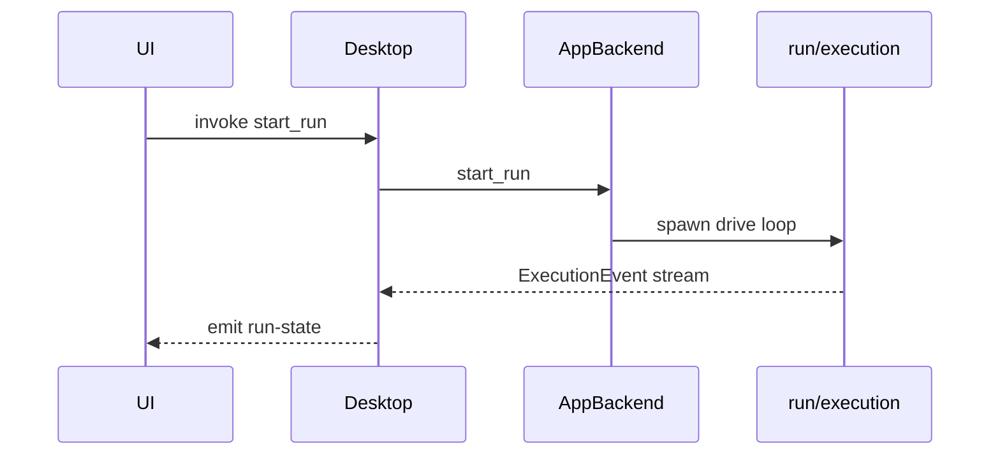

# AGENTS.md — Desktop

**Question this crate answers:** How does the UI invoke backend operations over Tauri IPC?

Thin Tauri adapter. Maps commands/events to `orchestration::AppBackend`. No engine, provider, or business logic.

## Architecture

```
ui (React)
  │ api.ts
  ▼
desktop (Tauri commands + events)
  │ AppBackend methods
  ▼
orchestration
```

### Module map

| Path | Owns |
| --- | --- |
| `lib.rs` | Tauri command handlers and app bootstrap |
| `ipc_types.rs` | Desktop IPC payload and command error types |
| `main.rs` | Binary entry, Tauri builder |
| `app_lifecycle.rs` | Window lifecycle cleanup |
| `run_event_bridge.rs` | Run-state event bridge and coalescing |
| `schedule_events.rs` | Schedule polling and status event emission |
| `terminal_events.rs` | Terminal event forwarding |
| `run_sleep_guard.rs` | macOS sleep prevention during runs |

Desktop is **transport only**: serialize DTOs, call `AppBackend`, emit events to UI.

## Dependency rules

**Allowed:** `orchestration` (public API: `AppBackend`, DTO re-exports), `tauri`, `serde`, `tokio`

**Forbidden (CI-enforced):**
- `engine`, `providers`
- `orchestration` internals (`run/execution/`, `adapters/`, entity modules)
- Business rules duplicated from orchestration or engine

## Code standards

1. **Thin handlers** — each `#[tauri::command]` forwards to one `AppBackend` method.
2. **DTO mapping** — use orchestration types; add desktop-only wrappers only for camelCase IPC shapes.
3. **Errors** — wrap `BackendError` in `CommandError`; serialize as string for frontend.
4. **Async/sync split** — run lifecycle commands async; bulk load/save may be sync (see threading doc).
5. **Events** — execution updates flow: backend channel → desktop task → `emit("run-state")` → UI listener.

## Patterns

### Where to add code

| Change | Location |
| --- | --- |
| New IPC command | `lib.rs` handler + matching method in `orchestration/backend/mod.rs` |
| New event to UI | `lib.rs` emit + `ui/src/api.ts` listener |
| App bootstrap payload | `BootstrapPayload` in `ipc_types.rs` + `ui/lib/types.ts` |
| Tauri plugin/window setup | `main.rs` or `lib.rs` setup hook |

### Request flow (run state)



### Testing

```bash
cargo test -p desktop
```

Test command wiring and payload shapes. Mock `AppBackend` where needed.

## Change checklist

1. Handler delegates to `AppBackend` — no orchestration logic inlined?
2. No `engine` or `providers` imports?
3. Frontend seam updated (`api.ts`, `types.ts`) if contract changed?
4. Run `./scripts/verify.sh test arch`.

## Related docs

- [`docs/architecture/contract.md`](../../docs/architecture/contract.md)
- [`docs/architecture/end-to-end-runtime.md`](../../docs/architecture/end-to-end-runtime.md) — invoke / event bridge path
- [`docs/architecture/threading-concurrency.md`](../../docs/architecture/threading-concurrency.md) — dual runtime, event bridge
- [`../../AGENTS.md`](../../AGENTS.md) — workspace map
