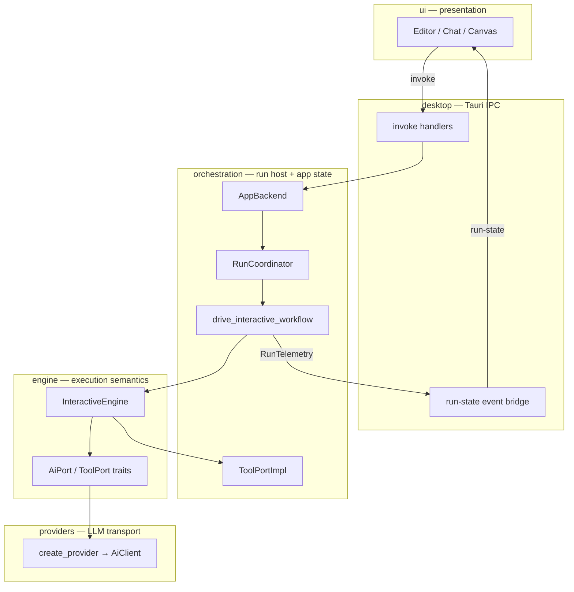
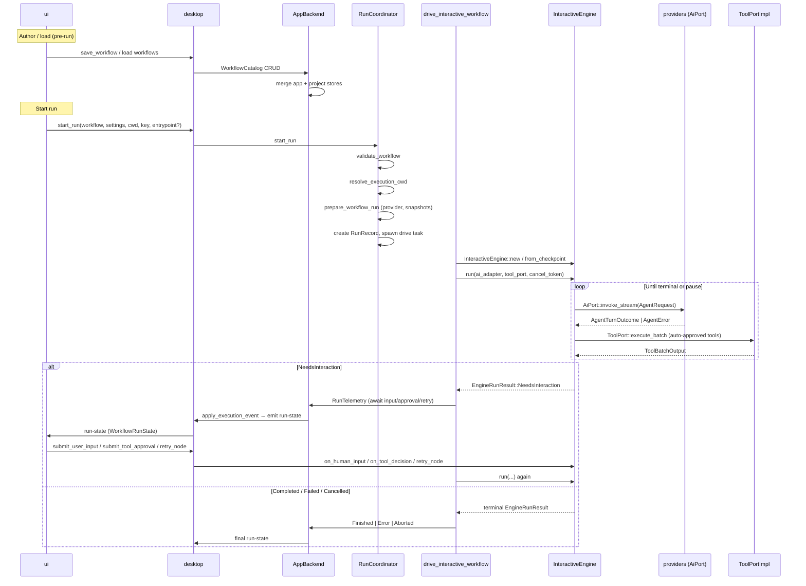
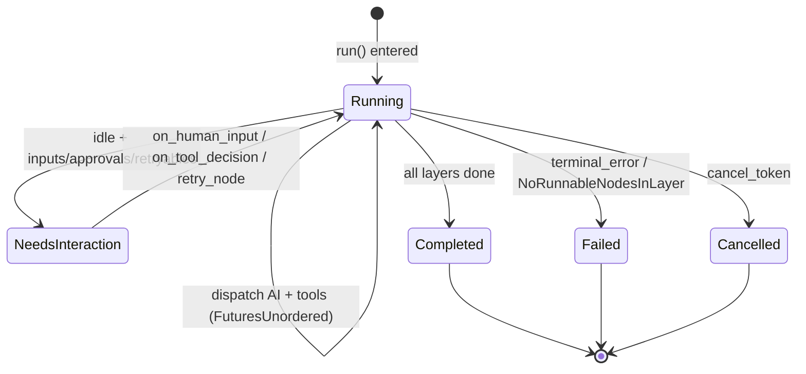
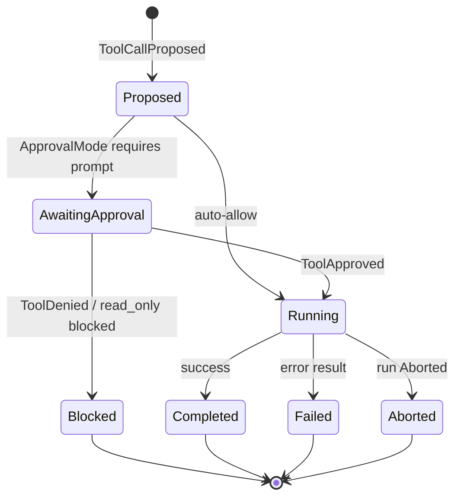
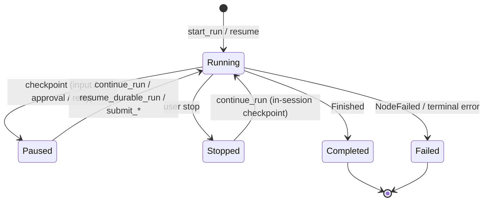
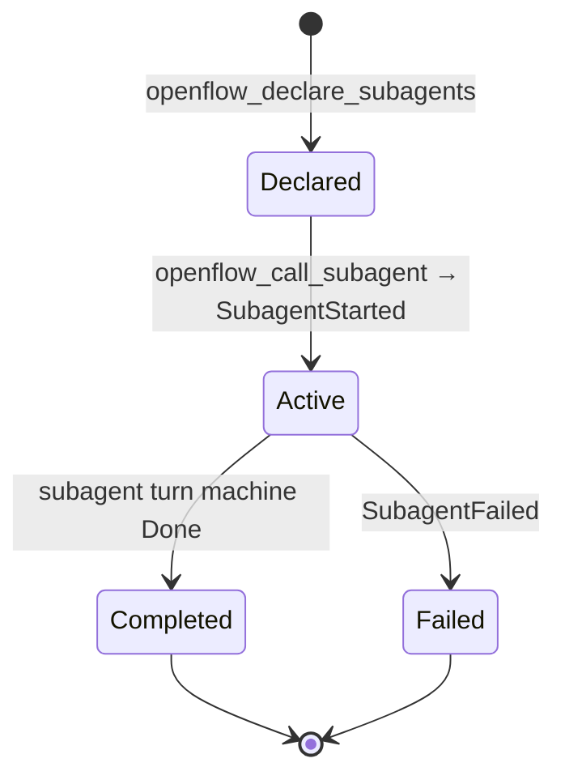
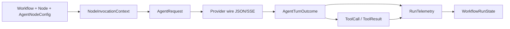

# OpenFlow End-to-End Runtime

Code-grounded reference for how a Workflow run moves from UI action through desktop IPC, orchestration, `InteractiveEngine`, provider LLM calls, tool/subagent execution, pause/resume gates, persistence, and back to UI events.

**Sources:** `docs/glossary.md`, `docs/architecture/contract.md`, and the cited Rust/TypeScript paths below. Where older docs disagree with code, this document trusts code.

---

## 1. One-page mental model



| Concern | Rule owner | Adapter / host |
| --- | --- | --- |
| Workflow graph validity, execution layers, turn semantics | **engine** (`graph/`, `execution/`) | orchestration calls `validate_workflow` before run |
| Tool approval policy (`ApprovalMode`) | **engine** (`tools/config.rs`) | orchestration filters tool catalog in `tool/registry.rs` |
| When to pause (`NeedsInteraction`) | **engine** (`InteractiveEngine::run`) | orchestration maps to `RunTelemetry` + session actions |
| Tool/subagent I/O, cwd, artifacts | **orchestration** (`run/execution/tool_port.rs`, `adapters/tool_impl/`) | implements `ToolPort` |
| LLM wire format, streaming, `AgentError` | **providers** (`client.rs`, `rig_adapter/`) | implements `AiPort` |
| Run session, checkpoints, trace projection | **orchestration** (`run/coordinator/`, `run/state.rs`) | desktop bridges to UI |
| Presentation, derived UI state | **ui** | never imports engine/providers |
| IPC transport | **desktop** | maps invoke ↔ `AppBackend` |

**Invariant:** only `orchestration/src/run/execution/` may construct `InteractiveEngine` (arch check enforced).

---

## 2. Lifecycle overview (sequence)



### Phase summary

| Phase | Entry | Key symbols | Owner |
| --- | --- | --- | --- |
| **Author / load** | Editor save, bootstrap | `WorkflowCatalog::load_all`, `save_all` | orchestration |
| **Validate** | Run start, engine construct | `validate_workflow` → `execution_layers` | engine |
| **Prep** | `start_run` | `prepare_workflow_run`, `resolve_callable_agent_snapshots` | orchestration |
| **Drive** | spawned tokio task | `drive_interactive_workflow`, `wire_run` | orchestration |
| **Pause / resume** | `NeedsInteraction` | `emit_interaction_pause`, `await_interaction_actions` | orchestration wraps engine |
| **Complete / fail** | `EngineRunResult` terminal | `Finished(RunReport)`, `NodeFailed`, `Cancelled` | engine decides; orchestration projects |

---

## 3. State machines

### 3.1 InteractiveEngine / EngineRunResult

**Source:** `crates/engine/src/execution/interactive_engine/mod.rs` → `EngineRunResult`, `InteractiveEngine::run`



| `EngineRunResult` variant | Meaning |
| --- | --- |
| `NeedsInteraction { inputs, approvals, retryables }` | Batch pause; run not terminal |
| `Completed(RunReport)` | All nodes finished; aggregated outputs + counters |
| `Failed(RunError)` | Non-recoverable run failure |
| `Cancelled` | User/system cancel via `CancellationToken` |

**Pause payloads:**

| Struct | Fields | When |
| --- | --- | --- |
| `EngineAwaitInput` | `node_id`, `label`, `context`, `is_initial` | Manual kickoff or `NeedsUserInput` / conversational `Message` |
| `EngineAwaitApproval` | `approval_id`, `node_id`, `label`, `tool_calls` | Batch has `requires_approval == true` |
| `EngineRetryableNode` | `node_id`, `label`, `error`, `interrupted` | Transient exhaustion, user interrupt, or recoverable node error |

### 3.2 Per-node turn (Control ↔ Work ↔ tools ↔ complete)

**Sources:** `ports/outbound.rs` → `AgentTurnPhase`, `AgentTurnOutcome`; `interactive_engine/completion.rs`

```mermaid
stateDiagram-v2
    [*] --> Control: build_request (default)
    Control --> Work: AgentTurnOutcome::ContinueWork
    Work --> Control: tool batch completes
    Control --> AwaitingInput: NeedsUserInput / Message (conversational)
    Control --> PendingTools: ToolCalls
    Work --> PendingTools: ToolCalls
    PendingTools --> RunningTools: auto-allow OR approved
    RunningTools --> Control: on_tool_results
    Control --> Completed: AgentTurnOutcome::Completed
    Work --> Completed: AgentTurnOutcome::Completed
    Control --> Failed: non-retryable AgentError
    Work --> Failed: non-retryable AgentError
    Control --> Backoff: AgentError::Transient
    Work --> Backoff: AgentError::Transient
    Backoff --> Control: retry_after elapsed
    Completed --> [*]
    Failed --> [*]
```

**`AgentTurnPhase` tool catalogs (disjoint):**

| Phase | Model-facing tools | Set in |
| --- | --- | --- |
| **Control** | `openflow_submit_node_output`, optional `openflow_request_user_input`, `openflow_continue_work` | `build_request` when node ∉ `work_phase_nodes` |
| **Work** | Executable tools from registry (+ `ToolPort::augment_request`) | node ∈ `work_phase_nodes` |

**`AgentTurnOutcome` routing (`completion.rs`):**

| Outcome | Effect |
| --- | --- |
| `Completed` | Store `NodeRunOutput`, clear recovery state, advance layer when all siblings done |
| `ContinueWork` | Insert into `work_phase_nodes`; next invoke is Work |
| `ToolCalls` | `apply_tool_calls` → approval policy → `pending_tool_batches` |
| `NeedsUserInput` | Conversational: pause; Autonomous: malformed-input recovery |
| `Message` | Conversational: pause; Autonomous: auto-continue nudge (max streak) |

### 3.3 ToolCallStatus lifecycle

**Source:** `crates/engine/src/tools/config.rs` → `ToolCallStatus`

Used for UI/orchestration projection (`events.rs`), not engine loop logic.



### 3.4 Orchestration session / RunStatus

**Sources:** `run/persistence.rs` → `RunStatus`; `run/state.rs` → `WorkflowRunState`, `AgentStatus`



**`AgentStatus` (per-node, projected):** `Idle` → `Queued` → `Started` → (`RunningTool` | `AwaitingInput` | `AwaitingToolApproval`) → (`Completed` | `Failed` | `Interrupted` | `Stopped`)

**`TraceStatus` (timeline entries):** `Queued` | `Running` | `Paused` | `Failed` | `Stopped` | `Completed`

Live flags on `WorkflowRunState`: `active`, `awaiting_node_ids`, `pending_approvals`, `status_by_node`, `chat_logs`, `run_trace`.

### 3.5 Subagent status

**Source:** `engine/tools/config.rs` → `SubagentStatus`; telemetry `SubagentsDeclared` / `SubagentStarted` / `SubagentCompleted` / `SubagentFailed`



Subagent turns run **inside** a parent `CALL_SUBAGENT` tool execution (`subagent_runtime.rs`), not as DAG layer peers.

---

## 4. Gates & decision matrix

| Gate | Trigger | Owner | Blocks? | Resume API | Failure mode | Source |
| --- | --- | --- | --- | --- | --- | --- |
| Workflow validation | Empty graph, duplicate ids, dangling edge, cycle | **engine** | Yes (start) | Fix workflow | `WorkflowValidationError` | `graph/validation.rs` → `validate_workflow` |
| Provider / key readiness | No resolvable API key (non-local provider) | **orchestration** | Yes (start) | Settings / transient key | Backend error to UI | `settings/provider.rs` → `resolve_provider_config` |
| `auto_start` vs kickoff | `auto_start: false` + empty transcript | **engine** | Yes (pause) | `submit_user_input` → `on_human_input` | Stalls layer until input | `mod.rs` → `schedule_manual_nodes_in_layer` |
| `request_user_input` | Model calls control tool / conversational turn | **engine** | Yes (pause) | `submit_user_input` | — | `completion.rs`, `allow_user_input` on `AgentRequest` |
| Tool approval (`ApprovalMode`) | Write-tier tool under `write` / `always_ask` | **engine** policy; **orch** catalog | Yes (pause) | `submit_tool_approval` → `on_tool_decision` | Deny → synthetic denied `ToolResult` | `tools/config.rs`, `completion.rs` |
| `read_only` tool exposure | Write-tier tool not in catalog | **orchestration** | Yes (model can't call) | Switch `ApprovalMode` | Tool unavailable to model | `tool/registry.rs` → `is_read_only` |
| Retryable node / `RetryPolicy` | `AgentError::Transient`, interrupt, recoverable fail | **engine** | Yes (pause) | `retry_node` | Exhaust → `failed_nodes` / run fail | `completion.rs`, `RetryPolicy` in `WorkflowSettings` |
| Cancel | User stop, run replaced | **orchestration** + token | Yes (terminal) | New run | `EngineRunResult::Cancelled` | `CancellationToken`, `stop_run` |
| Structured output / completion protocol | Invalid `openflow_submit_node_output` JSON | **engine** | No (nudge retry) | Auto (≤3 nudges) | Then `failed_nodes` | `AgentError::MalformedSubmitOutput` |
| DAG layer readiness | Upstream node lacks output | **engine** | No (wait) | Auto when upstream completes | — | `is_node_blocked`, `gather_call_ai_actions` |
| Checkpoint restore | User stop / durable resume | **orchestration** | — | `continue_run` / `resume_durable_run` | Hash / stale node mismatch | `checkpoint.rs`, `run_checkpoint_store.rs` |
| Callable agent snapshot | Unknown agent id at run start | **engine** | Yes (prep) | Fix workflow/agents | Prep error | `resolve_callable_agent_snapshots` |

**API key resolution order** (`resolve_api_key`): transient input panel → stored `ProviderProfile.api_key` → provider env var. Bedrock uses AWS profile/region, not API keys.

---

## 5. Data flowing across seams



| Seam | Type | Important fields |
| --- | --- | --- |
| Workflow → invocation | `NodeInvocationContext` | upstream outputs, `entrypoint_text`, `shared_context`, callable snapshots |
| → `AgentRequest` | `build_agent_request` | `system_messages`, `task_prompt`, `input` JSON, `output_schema`, `tool_config`, `turn_phase`, `allow_user_input`, `transcript` |
| → provider | `AiPort::invoke_stream` | Model id, reasoning options, phase-specific `available_tools` (`mapping/mod.rs` → `all_tool_specs`) |
| ← provider | `AgentTurnOutcome` | `Completed.output`, `ToolCalls.tool_calls`, control transitions |
| Tool execution | `ToolPort::execute_batch` | `ToolBatchOutput` → `on_tool_results` |
| → UI | `RunTelemetry` / `ExecutionEvent` | `ChatMessageDelta`, `NodeAwaitingInput`, `ToolApprovalRequested`, `NodeCompleted`, `Finished` |
| Projection | `apply_event_to_run_state` | Mutates `status_by_node`, `chat_logs`, `pending_approvals`, `outputs` |

Orchestration wraps raw `AiPort` with `AiInvocationAdapter` to emit streaming deltas and usage before outcomes reach projection.

---

## 6. Persistence map

| Data | Location | Writer | Notes |
| --- | --- | --- | --- |
| App workflows | `{data_local}/openflow/workflows.json` | `app_workflow_store` | Unassigned workflows only on save |
| Project workflows | `{project}/.flow/workflows/{id}.workflow.json` | `project_workflow_store` | Wins on ID collision at load |
| Settings + API keys | `{data_local}/openflow/settings.json` | `settings_store` | Plaintext keys |
| Projects registry | `{data_local}/openflow/projects.json` | `project_store` | Bindings + assigned workflow ids |
| Saved agents (`CallableAgent`) | `{data_local}/openflow/agents.json` | `agent_store` | Snapshotted at run start |
| Run record | `{run_root}/{run_id}/run.json` | `RunCoordinator` | `RunRecord` + `workflow_snapshot` |
| Checkpoints | `{run_root}/{run_id}/checkpoints/NNNN.json` | `run_checkpoint_store` | Engine + `WorkflowRunState` projection |
| Artifacts | `{run_root}/{run_id}/artifacts/` | `ArtifactStore` | Large tool outputs |
| In-session checkpoint | `RunSession.engine_checkpoint` | drive lifecycle | User stop → Continue (no disk required) |

**Merge rule:** `WorkflowCatalog::load_all` loads app store, then overlays project-discovered workflows (project wins on same `WorkflowId`).

---

## 7. Concurrency & cancellation

| Mechanism | Behavior | Source |
| --- | --- | --- |
| Single active run | `RunCoordinator` replaces prior run | `coordinator/mod.rs` |
| Layer parallelism | Same-layer ready nodes dispatch concurrently via `FuturesUnordered` | `interactive_engine/mod.rs` |
| Completion ordering | AI/tool completions applied serially as they finish | `in_flight.next()` in `run()` |
| Cross-layer | Strict: layer N+1 after all layer N outputs | `current_layer_complete` |
| Tool batch parallelism | `ToolConcurrency::Shared` tools spawn in parallel inside batch | `tool_port.rs` |
| Exclusive tools | Semaphore permit before spawn | `tool/registry.rs`, `tool_port.rs` |
| Subagents | Nested in parent tool; not layer-parallel | `subagent_runtime.rs` |
| Cancel | `CancellationToken` checked each `run()` iteration | `stop_run`, run replace |
| Event coalescing | ~30ms while run active | `desktop/run_event_bridge.rs` |
| Blocking I/O | Filesystem/subprocess on `spawn_blocking` | orchestration adapters |

**Headless vs interactive:** both call `drive_interactive_workflow` with the same `InteractiveEngine`. Headless (`run_workflow_headless`) uses scripted `ExecutionAction` queues instead of UI; checkpoints are not durably persisted without coordinator.

---

## 8. Worked scenarios (step-by-step with types)

### A. Linear 2-node auto-start happy path

1. UI: `start_run` with `entrypoint: null`; both nodes `auto_start: true`.
2. `validate_workflow` → layers `[ [A], [B] ]`.
3. `InteractiveEngine::new` → layer 0: node A `gather_call_ai_actions` → `AiPort::invoke_stream`.
4. Outcome `Completed(AgentTurnSuccess)` → output stored → layer advances.
5. Node B receives upstream map in `AgentRequest.input` → completes → `EngineRunResult::Completed(RunReport)`.
6. `RunTelemetry::Finished(report)` → `WorkflowRunState.active = false`.

### B. Node pauses for user input, resume

1. Node with `auto_start: false` hits layer → `schedule_manual_nodes_in_layer` → `awaiting_nodes`.
2. `run()` returns `NeedsInteraction { inputs: [EngineAwaitInput { is_initial: true, ... }], ... }`.
3. Orchestration emits `NodeAwaitingInput` → UI composer enabled.
4. User: `submit_user_input` → `engine.on_human_input(node_id, text)`.
5. Next `run()` → AI invoke with User message in transcript.

### C. Tool needs approval, approve, continue

1. Model returns `AgentTurnOutcome::ToolCalls` with write-tier tool under `ApprovalMode::Write`.
2. `apply_tool_calls` sets `requires_approval: true` on batch.
3. `NeedsInteraction { approvals: [EngineAwaitApproval] }` → `ToolApprovalRequested`.
4. User: `submit_tool_approval(allow: true)` → `on_tool_decision` clears approval flag.
5. `take_ready_tool_batches` → `ToolPort::execute_batch` inside `run()`.
6. `on_tool_results` → next turn **Control** phase.

### D. Write tool blocked under `read_only`

1. `NodeToolConfig.approval_mode = ReadOnly`.
2. `ToolRegistry` exposes only read-tier tools (`read`, `search`, …); write tools omitted.
3. Model cannot invoke `bash` / `write`; if attempted via policy edge, `ToolDecision` path not reached for unavailable tools.

### E. Node fails / retry / exhaust

1. Provider returns `AgentError::Transient` → backoff via `WorkflowSettings.retry_policy`.
2. After streak exhaust → `failed_nodes` → `EngineRetryableNode` in `NeedsInteraction`.
3. UI: `retry_node` → `engine.retry_node` clears failure state.
4. Non-retryable error → `Failed(RunError::NodeFailed)` → run terminal.

### F. Cancel mid-run

1. UI: `stop_run` → cancel token + `snapshot_and_abort`.
2. In-flight work sees cancel on next `run()` loop check → `EngineRunResult::Cancelled`.
3. `RunTelemetry::Aborted` → nodes/tools marked stopped/aborted in projection.

### G. Subagent call

1. Parent Work turn calls `openflow_declare_subagents` → `SubagentsDeclared`.
2. `openflow_call_subagent` → `SubagentStarted`; nested state machine in `subagent_runtime.rs`.
3. Subagent uses Control-only (`allow_user_input: false`); `ContinueWork` ↔ Work ↔ tools until Done.
4. `SubagentCompleted` / `SubagentFailed` → parent receives `ToolResult`.

### H. Headless acceptance path

1. Test calls `run_workflow_headless(workflow, ...)`.
2. Same `wire_run` + `drive_interactive_workflow`; manual inputs/approvals dequeued from script.
3. Returns `WorkflowRunSnapshot` or error; no Tauri `run-state` events.

---

## 9. Invariants & non-goals

**Engine guarantees**

- Valid workflows have acyclic execution layers; `validate_workflow` is the gate.
- Control and Work tool catalogs are never mixed on one `AgentRequest`.
- `NeedsInteraction` is the only pause surface from `run()`; orchestration must not invent parallel pause semantics.
- Node outputs propagate downstream only after `Completed` outcome stores structured output.

**Orchestration must not**

- Reimplement approval rules (only project `ToolCallStatus`, filter catalogs).
- Branch on concrete provider types (use `Box<dyn AiPort>`).
- Construct `InteractiveEngine` outside `run/execution/`.

**Providers must not**

- Decide tool approval, DAG advancement, or run lifecycle.
- Offer `openflow_request_user_input` when `allow_user_input == false`.
- Persist workflow or session state.

**Boundary violations to avoid:** UI importing engine types directly; desktop calling orchestration internals; engine performing filesystem/HTTP I/O.

---

## 10. Appendix

### A. Key file index

| Path | Role |
| --- | --- |
| `crates/ui/src/api.ts` | IPC seam; `start_run`, `submit_*`, `listenToRunState` |
| `crates/ui/src/context/appProvider/useRunSession.ts` | Run / continue / kickoff handlers |
| `crates/desktop/src/commands/run.rs` | Tauri command wiring |
| `crates/desktop/src/run_event_bridge.rs` | `RunTelemetry` → `run-state` |
| `crates/orchestration/src/backend/runs.rs` | `AppBackend` run entry |
| `crates/orchestration/src/run/coordinator/mod.rs` | Session lifecycle |
| `crates/orchestration/src/run/coordinator/session.rs` | `prepare_workflow_run` |
| `crates/orchestration/src/run/prep.rs` | Reasoning defaults, execution prep |
| `crates/orchestration/src/run/execution/drive/mod.rs` | Main drive loop |
| `crates/orchestration/src/run/execution/drive/interaction.rs` | Pause/resume host |
| `crates/orchestration/src/run/execution/events.rs` | `apply_event_to_run_state` |
| `crates/orchestration/src/run/execution/tool_port.rs` | `ToolPort` impl |
| `crates/orchestration/src/run/execution/ai_adapter.rs` | Streaming + telemetry wrapper |
| `crates/orchestration/src/run/execution/headless.rs` | Acceptance runner |
| `crates/orchestration/src/workflow/catalog.rs` | Workflow merge/split |
| `crates/orchestration/src/settings/provider.rs` | Key resolution |
| `crates/engine/src/execution/interactive_engine/mod.rs` | `InteractiveEngine`, `EngineRunResult` |
| `crates/engine/src/execution/interactive_engine/completion.rs` | Turn outcome routing |
| `crates/engine/src/execution/node_invocation.rs` | `AgentRequest` assembly |
| `crates/engine/src/execution/subagent_runtime.rs` | Subagent builtins |
| `crates/engine/src/graph/validation.rs` | Graph gates |
| `crates/engine/src/ports/outbound.rs` | Port contracts |
| `crates/engine/src/execution/telemetry.rs` | `RunTelemetry` |
| `crates/providers/src/lib.rs` | `create_provider` |
| `crates/providers/src/client.rs` | `AiClient: AiPort` |
| `crates/providers/src/mapping/mod.rs` | Tool specs + outcome parsing |

### B. Enum cheat sheet

| Enum | Variants | File |
| --- | --- | --- |
| `EngineRunResult` | `NeedsInteraction`, `Completed`, `Failed`, `Cancelled` | `interactive_engine/mod.rs` |
| `AgentTurnPhase` | `Control`, `Work` | `ports/outbound.rs` |
| `AgentTurnOutcome` | `Completed`, `ToolCalls`, `NeedsUserInput`, `ContinueWork`, `Message` | `ports/outbound.rs` |
| `AgentError` | `Transient`, `Permanent`, `Failed`, `MalformedSubmitOutput`, `Interrupted` | `ports/outbound.rs` |
| `ApprovalMode` | `ReadOnly`, `AlwaysAsk`, `Write`, `Yolo` | `tools/config.rs` |
| `ToolDecision` | `AutoAllow`, `Prompt`, `Deny` (reserved) | `tools/config.rs` |
| `ToolCallStatus` | `Proposed`, `AwaitingApproval`, `Running`, `Completed`, `Blocked`, `Failed`, `Aborted` | `tools/config.rs` |
| `SubagentStatus` | `Declared`, `Active`, `Completed`, `Failed` | `tools/config.rs` |
| `RunStatus` | `Running`, `Paused`, `Stopped`, `Completed`, `Failed` | `run/persistence.rs` |
| `RunCheckpointReason` | `AwaitingInput`, `AwaitingToolApproval`, `AwaitingRetry`, `UserStopped`, `Completed`, `Failed` | `run/persistence.rs` |
| `AgentStatus` | `Idle`, `Queued`, `Started`, `AwaitingInput`, `AwaitingToolApproval`, `RunningTool`, `Completed`, `Failed`, `Interrupted`, `Stopped` | `run/state.rs` |
| `TraceStatus` | `Queued`, `Running`, `Paused`, `Failed`, `Stopped`, `Completed` | `run/state.rs` |
| `WorkflowValidationError` | `EmptyWorkflow`, `DuplicateNodeId`, `DuplicateEdgeId`, `MissingEndpoint`, `SelfEdge`, `Cycle`, `InternalConsistency` | `graph/validation.rs` |

**`RunTelemetry` variants:** `NodeQueued`, `NodeStarted`, `ChatMessage`, `ChatMessageDelta`, `NodeAwaitingInput`, `ToolCallProposed`, `ToolApprovalRequested`, `ToolApproved`, `ToolDenied`, `ToolStarted`, `ToolRetrying`, `ToolUpdated`, `ToolCompleted`, `ToolArtifactCreated`, `FileChanged`, `EditBatchRecorded`, `NodeCompleted`, `NodeFailed`, `NodeInterrupted`, `NodeErrored`, `Finished`, `Aborted`, `Error`, `SubagentsDeclared`, `SubagentStarted`, `SubagentCompleted`, `SubagentFailed`, `PhaseTimed`, `UsageReported`, `AiInvokeFailed`.

### C. Ambiguities / dead paths / TODOs

| Item | Notes |
| --- | --- |
| `ToolDecision::Deny` | Reserved in `decision_from_mode`; not emitted today. |
| No header Run button | Runs start via ⌘/Ctrl+Enter or chat kickoff composer (`useRunSession.ts`). |
| `AiInvokeFailed` | Emitted but `apply_event_to_run_state` intentionally no-ops (incident hook). |
| Stale pause actions | Wrong-node input/approval logged as `"ignored …"` `Error` event; skipped non-fatally. |
| `ReadOnly` approval matrix | Engine `decision_from_mode` auto-allows all tiers; write blocking is enforced by orchestration tool catalog filtering. |

### D. Suggested follow-up deep dives

- [`run-persistence.md`](run-persistence.md) — durable replay and resume edge cases
- [`callable-agents.md`](callable-agents.md) — snapshot rules and subagent model
- [`technical-overview.md`](technical-overview.md) — complementary architecture narrative
- [`threading-concurrency.md`](threading-concurrency.md) — runtime topology and layer concurrency
- `crates/orchestration/tests/workflow_acceptance.rs` — headless scenario catalog

---

*Spot-check (2026-07-18): verified `EngineRunResult` variants (`mod.rs:62–72`), `validate_workflow` delegation (`validation.rs:64–66`), `ApprovalMode` + `decision_from_mode` (`config.rs:69–77`), `RunStatus` variants (`persistence.rs:9–14`), and `RunTelemetry` terminal variants (`telemetry.rs:126–128`).*
