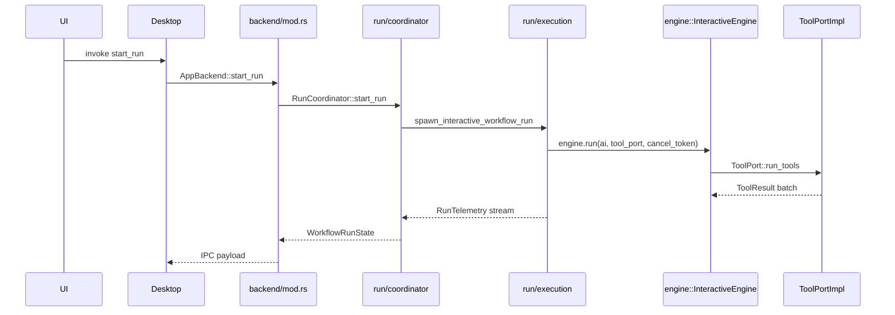

# Orchestration crate layout

`crates/orchestration/src` is grouped by app concern. Entity folders hold application logic and port traits. Centralized `adapters/` folders hold concrete storage, tool, MCP, git, and LSP implementations.

Rust import paths match the folder layout. For example, `workflow/catalog.rs` is `orchestration::workflow::catalog`, and `run/execution/` is `orchestration::run::execution`.

## Module paths

| What you see on disk | What Rust sees in code |
| --- | --- |
| `backend/mod.rs` | `orchestration::backend` |
| `workflow/catalog.rs` | `orchestration::workflow::catalog` |
| `run/coordinator/mod.rs` | `orchestration::run::coordinator` |
| `run/execution/` | `orchestration::run::execution` |
| `tool/registry.rs` | `orchestration::tool::registry` |
| `adapters/tool_impl/` | `orchestration::tools` internal alias |
| `adapters/infrastructure/git` | `orchestration::git` public alias |
| `adapters/infrastructure/lsp` | `orchestration::lsp` public alias |

## Roles

```text
desktop / ui
    │
    ▼
backend/                  AppBackend facade and composition root
    │
    ├── workflow/          workflow catalog and authoring services
    ├── agent/             saved agent library
    ├── project/           project registry and file references
    ├── settings/          settings facade, provider readiness, skills
    ├── schedule/          schedule evaluation and status
    ├── run/               active runs, checkpoints, state projection
    ├── terminal/          embedded terminal sessions
    └── tool/              tool registry, dispatch, retry, output

adapters/
    ├── storage/           JSON and checkpoint persistence
    ├── tool_impl/         concrete read/search/write/bash/edit tools
    ├── mcp/               MCP discovery and run clients
    └── infrastructure/    git and LSP integrations
```

| Role | Folder | Job |
| --- | --- | --- |
| Composition | `backend/` | Construct services, expose the stable facade that desktop calls. |
| Application services | `workflow/`, `agent/`, `project/`, `settings/`, `schedule/`, `run/`, `terminal/`, `tool/` | Apply app rules, coordinate ports, and return API DTOs. |
| Port traits | `{entity}/ports.rs` | Define store/catalog seams consumed by entity services. |
| Run state | `run/state/` | Project `RunTelemetry` into `WorkflowRunState` for UI and IPC. |
| Concrete storage | `adapters/storage/` | Read and write JSON files under `{data_local}/openflow/`, project workflow files, incidents, and run checkpoints. |
| Runtime I/O | `adapters/tool_impl/`, `adapters/mcp/`, `adapters/infrastructure/` | Perform filesystem, subprocess, MCP, git, and LSP work. |
| Shared DTOs | `api.rs`, `error.rs` | Define transport shapes and `BackendError` used across the crate. |

Engine semantics stay in `crates/engine`. Orchestration wires the engine to providers, stores, tools, projects, and desktop-facing state.

## Directory map

```text
orchestration/src/
├── lib.rs
├── api.rs
├── error.rs
├── backend/
│   ├── mod.rs
│   └── tests.rs
├── adapters/
│   ├── storage/
│   │   ├── agent_store.rs
│   │   ├── app_workflow_store.rs
│   │   ├── incident_store.rs
│   │   ├── project_store.rs
│   │   ├── project_workflow_store.rs
│   │   ├── run_checkpoint_store.rs
│   │   ├── settings_store.rs
│   │   ├── skill_store.rs
│   │   └── template_store.rs
│   ├── tool_impl/
│   ├── mcp/
│   └── infrastructure/
├── agent/
├── incident/
├── project/
├── run/
│   ├── coordinator/
│   ├── execution/
│   ├── persistence.rs
│   └── state/
├── schedule/
├── settings/
├── terminal/
├── tool/
└── workflow/
    ├── authoring/
    └── catalog.rs
```

## Entity reference

### Workflow

| File | Module path | Responsibility |
| --- | --- | --- |
| `workflow/catalog.rs` | `workflow::catalog` | Merge app and project workflows; assign, unassign, rename, and split saves. |
| `workflow/authoring/` | `workflow::authoring` | AI-assisted workflow draft and validation turns. |
| `workflow/ports.rs` | `workflow::ports` | Workflow store traits consumed by the catalog. |
| `adapters/storage/app_workflow_store.rs` | `adapters::storage::app_workflow_store` | Persist app-level `workflows.json`. |
| `adapters/storage/project_workflow_store.rs` | `adapters::storage::project_workflow_store` | Discover and save per-project workflow files. |

Catalog owns merge policy. Stores only read and write bytes.

### Agent

| File | Module path | Responsibility |
| --- | --- | --- |
| `agent/library.rs` | `agent::library` | Callable agent CRUD and `create_agent_node`. |
| `agent/ports.rs` | `agent::ports` | Agent store trait. |
| `adapters/storage/agent_store.rs` | `adapters::storage::agent_store` | Persist `openflow/agents.json`. |

### Project

| File | Module path | Responsibility |
| --- | --- | --- |
| `project/registry.rs` | `project::registry` | Register and load project folders. |
| `project/file_refs.rs` | `project::file_refs` | Read project file-reference content. |
| `project/ports.rs` | `project::ports` | Project store trait and project DTO. |
| `adapters/storage/project_store.rs` | `adapters::storage::project_store` | Persist `openflow/projects.json`. |

### Run

| File | Module path | Responsibility |
| --- | --- | --- |
| `run/coordinator/mod.rs` | `run::coordinator` | Active session mutex; `start_run`, `submit_*`, `stop_run`, resume, replay, interrupts. |
| `run/execution/` | `run::execution` | Host loop, AI adapter, `ToolPortImpl`, headless execution, telemetry event projection. |
| `run/persistence.rs` | `run::persistence` | Durable run roots, records, and checkpoint metadata. |
| `run/ports.rs` | `run::ports` | Run checkpoint store trait. |
| `run/state/mod.rs` | `run::state` | `WorkflowRunState` projected for UI and IPC. |
| `adapters/storage/run_checkpoint_store.rs` | `adapters::storage::run_checkpoint_store` | Persist run records and engine checkpoints. |

Only `run/execution/` constructs or drives `InteractiveEngine`, as required by the [architecture contract](contract.md).

### Settings

| File | Module path | Responsibility |
| --- | --- | --- |
| `settings/facade.rs` | `settings::facade` | Settings UX backend: redaction, skill list, provider readiness, validation summary. |
| `settings/provider.rs` | `settings::provider` | Key precedence: transient input, stored key, then environment. |
| `settings/model.rs` | `settings::model` | Persisted settings DTOs. |
| `settings/ports.rs` | `settings::ports` | Settings and skill catalog traits. |
| `adapters/storage/settings_store.rs` | `adapters::storage::settings_store` | Persist `settings.json`. |
| `adapters/storage/skill_store.rs` | `adapters::storage::skill_store` | Scan configured roots for `SKILL.md` files. |

### Tool and infrastructure

| File or folder | Module path | Responsibility |
| --- | --- | --- |
| `tool/registry.rs` | `tool::registry` | Register builtin tools and their `ToolTier` and `ToolConcurrency`. |
| `tool/runner.rs` | `tool::runner` | Execute registered tools and persist large artifacts. |
| `tool/dispatch.rs` | `tool::dispatch` | Route calls to concrete tool implementations. |
| `tool/retry.rs` | `tool::retry` | Retry transient tool failures according to workflow policy. |
| `adapters/tool_impl/` | `tools` internal alias | Concrete read, search, find, write, edit, bash, grep, and patch implementations. |
| `adapters/mcp/` | `adapters::mcp` | MCP server discovery and per-run clients. |
| `adapters/infrastructure/git` | `git` public alias | Execution-cwd-scoped diff and revert operations. |
| `adapters/infrastructure/lsp` | `lsp` public alias | LSP settings and format/diagnostic integration. |

### Incident, schedule, terminal, and template

| File or folder | Module path | Responsibility |
| --- | --- | --- |
| `incident/` | `incident` | Record, list, dismiss, and clear backend incidents. |
| `schedule/` | `schedule` | Evaluate workflow schedules and status. |
| `terminal/` | `terminal` | Manage embedded terminal sessions. |
| `adapters/storage/template_store.rs` | `adapters::storage::template_store` | Persist node templates in `openflow/templates.json`. |

## Request flow: start a run



`AppBackend` does not embed run logic. It delegates run lifecycle to `RunCoordinator`.

## Where to add code

| Change | Put it here |
| --- | --- |
| New workflow merge rule | `workflow/catalog.rs`. |
| New workflow file layout | `adapters/storage/app_workflow_store.rs` or `adapters/storage/project_workflow_store.rs`. |
| New project registry behavior | `project/registry.rs` plus `project/ports.rs` if the store seam changes. |
| New run lifecycle step | `run/coordinator/mod.rs` or `run/execution/`. |
| New UI run field | `run/state/mod.rs` plus `engine::RunTelemetry` if the engine emits new state. |
| New builtin tool | `adapters/tool_impl/`, `tool/registry.rs`, `tool/dispatch.rs`, and `crates/engine/src/tools/config.rs`; also update `NODE_RUNTIME_PREAMBLE` in `crates/engine/src/execution/node_invocation.rs`. |
| New settings field | `settings/model.rs`, `adapters/storage/settings_store.rs`, and `settings/facade.rs` if UI-facing. |
| New desktop command | Delegate in `backend/mod.rs`; implement in the owning service module. |

## Import rules

| Folder | May import |
| --- | --- |
| `backend/` | Entity services, storage adapters, `api`, and `error`. |
| `workflow/`, `agent/`, `project/`, `settings/`, `tool/` | Engine types, local ports, sibling modules, and shared DTOs. They must not import `crate::adapters::`. |
| `run/` | Engine types, providers through `AiPort`, tool infrastructure, run ports, and run state. |
| `adapters/storage/` | Engine types, entity port traits, filesystem/JSON support. |
| `adapters/tool_impl/`, `adapters/mcp/`, `adapters/infrastructure/` | Engine tool types and concrete I/O crates. |

Cross-entity work goes through services or `backend/`. Entity services should depend on port traits when a concrete store would otherwise leak persistence details.

## Persistence locations

| Store module | On-disk path |
| --- | --- |
| `app_workflow_store` | `{data_local}/openflow/workflows.json` |
| `project_workflow_store` | `{project}/.flow/workflows/{id}.workflow.json` |
| `agent_store` | `{data_local}/openflow/agents.json` |
| `project_store` | `{data_local}/openflow/projects.json` |
| `settings_store` | `{data_local}/openflow/settings.json` |
| `template_store` | `{data_local}/openflow/templates.json` |
| `incident_store` | `{data_local}/openflow/incidents.json` |
| `run_checkpoint_store` | `{data_local}/openflow/runs/` or the project-scoped run root selected by orchestration |

## Related docs

- [Architecture contract](contract.md) defines layer boundaries.
- [Coding patterns](../contributing/coding-patterns.md) lists owner paths and runtime rules.
- [AGENTS.md](../../AGENTS.md) maps common change paths.
