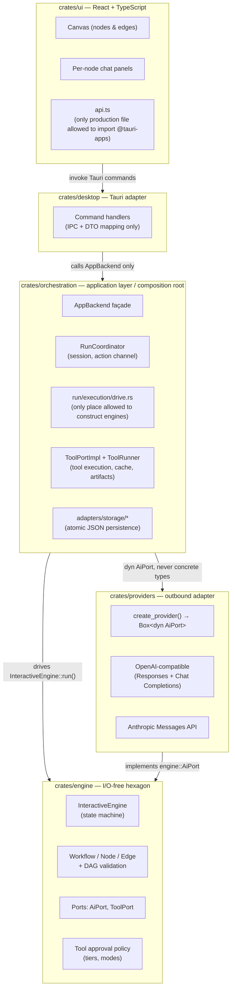
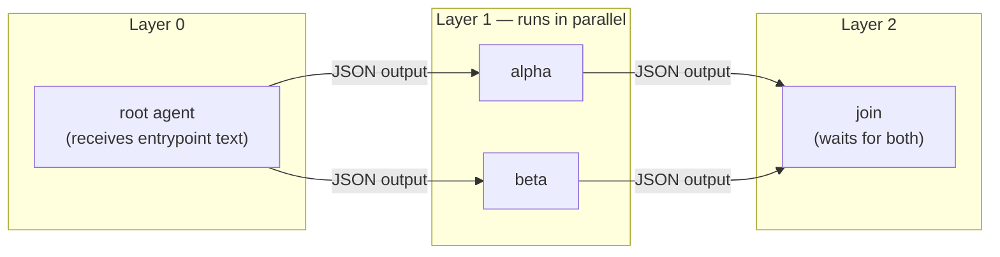
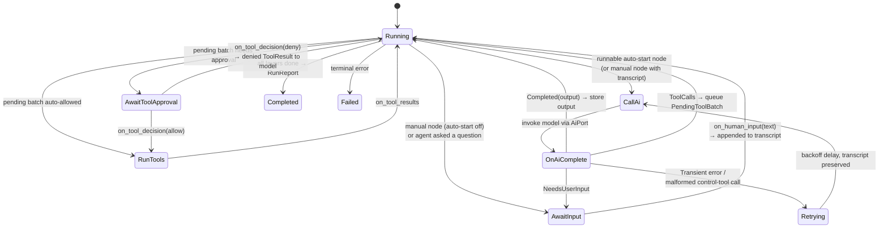
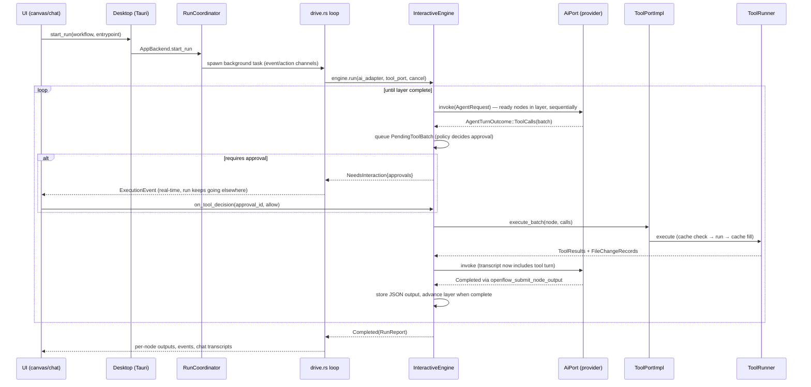
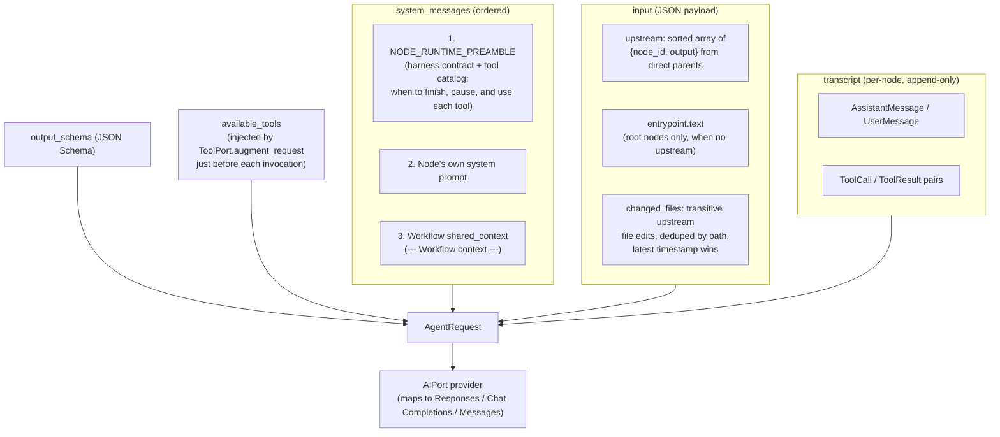
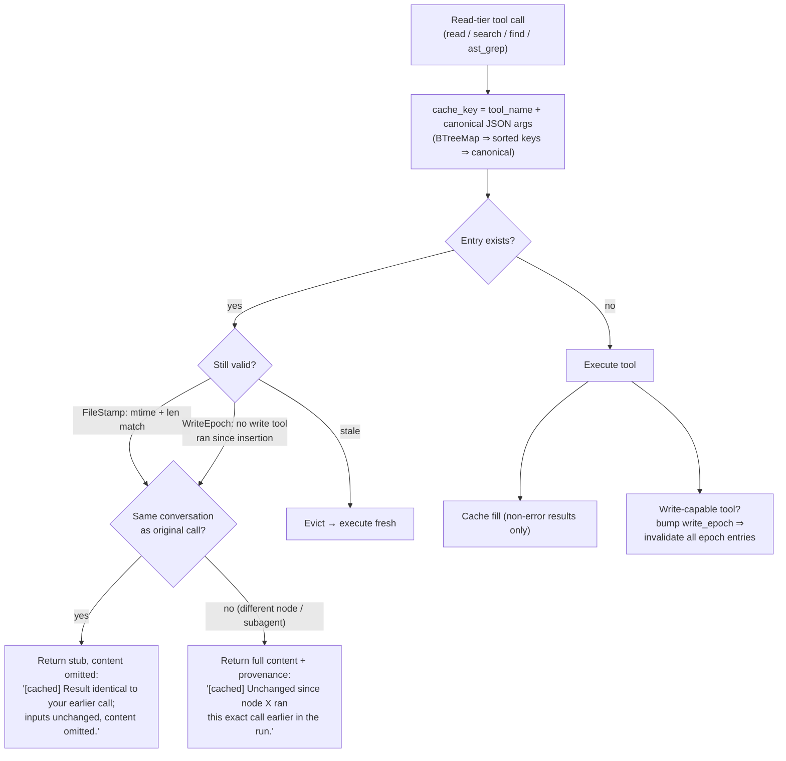
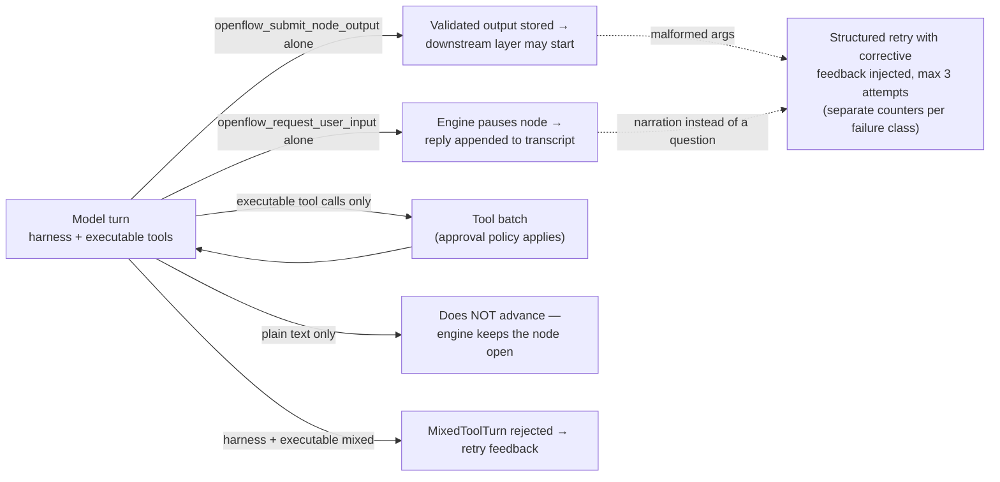
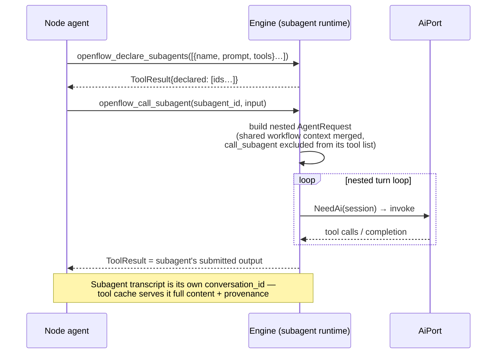

# OpenFlow Technical Overview

How context flows, how caching works, how the architecture is layered, how nodes execute, and where the agentic harness diverges from convention.

All claims reference source files; diagrams are Mermaid.

---

## 1. Architecture Layout

OpenFlow is **nested hexagonal architecture**: five layers, each an adapter for the layer above and a consumer of the layer below. Dependencies point strictly inward and are CI-enforced by [`../../scripts/check-architecture.sh`](../../scripts/check-architecture.sh), which reads [`../../crates/workspace-checks/arch-check-rules.toml`](../../crates/workspace-checks/arch-check-rules.toml).

Key constraints (all CI-checked, not just documented):

| Rule | Enforcement |
|---|---|
| Engine has **zero I/O** — no filesystem, no HTTP, no `unwrap`/`expect`/`panic` | Clippy denies + forbidden-dep table (`reqwest`, `tauri` banned in engine) |
| Only `orchestration/run/execution/` may construct `InteractiveEngine` | Tier-3 arch check |
| Desktop imports `orchestration::Workflow`, never `engine::Workflow` | Re-export boundary; ban tables |
| Orchestration may only import `create_provider` + config types from providers | Allowlist; `AiClient` banned |
| Engine public API is snapshot-tested | `crates/engine/tests/snapshots/public_api.txt` |

The engine answers *"what is a valid workflow and how does a run behave"*; orchestration answers *"how does the app store, wire, and host runs"*; providers answer *"how do we speak to a specific LLM"*. UI and Desktop are transport only.

---

## 2. Nodes and Flow

A workflow is a DAG of agent nodes. Validation ([graph/validation.rs](../../crates/engine/src/graph/validation.rs)) topologically sorts the graph into **execution layers** — all nodes in a layer have all dependencies satisfied by previous layers and run **concurrently**.

### The engine state machine

[`InteractiveEngine`](../../crates/engine/src/execution/interactive_engine/mod.rs) is a **sans-I/O state machine**. It never calls a model or runs a tool itself — `run()` invokes `AiPort` and `ToolPort` until the workflow completes, fails, cancels, or returns `NeedsInteraction`. The host feeds human input and approvals back via `on_*` handlers, then calls `run()` again.

`EngineRunResult::NeedsInteraction` is the **only** surface orchestration sees during a run — it batches every paused node at once (`inputs` + `approvals` + `retryables`), so the UI can show all pending human work across parallel branches simultaneously.

### One full node turn, end to end

---

## 3. Context Assembly

Context is **engine-owned and deterministic**. Providers receive an ordered `AgentRequest` and map it to wire format verbatim — they never edit prompts ([node_invocation.rs](../../crates/engine/src/execution/node_invocation.rs)).

Notable properties:

- **Deterministic ordering.** Upstream outputs are sorted by node ID; `serde_json::Value` maps are BTreeMap-backed, so the same graph state always produces byte-identical input. This is what makes tool-result caching keyable on raw arguments (§4).
- **Transitive file-change provenance.** `upstream_changed_files` walks *all* transitive ancestors, not just direct parents, and merges `FileChangeRecord`s (rename chains collapse to the destination path). A node three hops downstream knows exactly which files the run has touched before it starts — without re-reading anything.
- **Transcript ≠ context blob.** Each node has its own append-only transcript of typed items (`AgentTranscriptItem`). Human replies, tool turns, and retries all extend the same transcript, so a retried node *continues* rather than restarts.
- **Tool catalog in preamble.** `NODE_RUNTIME_PREAMBLE` documents every builtin and harness tool with when-to-use guidance. Per-turn `available_tools` schemas remain authoritative for parameters; the preamble is the cross-tool usage guide. **When you add or materially change a tool**, update both `orchestration/src/tool/registry.rs` (schema + description) and the `## Available tools` section of `NODE_RUNTIME_PREAMBLE` in `engine/src/execution/node_invocation.rs`. New harness tools (e.g. submit, request input) also need matching preamble sections.

---

## 4. Caching

OpenFlow's cache is not a prompt cache — it is a **per-run, cross-node, validated tool-result cache** ([tool/cache.rs](../../crates/orchestration/src/tool/cache.rs), served from [tool/runner.rs](../../crates/orchestration/src/tool/runner.rs)). The common waste pattern in multi-agent runs is downstream agents re-orienting: re-reading the same files and re-running the same searches their parents already ran. OpenFlow intercepts that.

Three design choices worth noting:

1. **Validation at hit time, not TTL.** Single-file reads carry an `mtime + length` stamp checked against the live filesystem on every lookup. Multi-file results (search, directory reads) carry a **write epoch** — a global counter bumped whenever any write-capable tool runs or an edit batch is reverted. The cache can never serve a stale view of the workspace.
2. **Conversation-aware degradation.** The cache knows which transcript the original result went into (`conversation_id` = node ID, or a unique session ID for subagents). A repeat call from the *same* transcript gets a content-omitting stub — the content is already in the model's context, so resending it would only burn tokens. A repeat from a *different* node gets the full content plus a provenance note, so the model knows the data is unchanged and can trust prior conclusions.
3. **Per-run scoping.** The cache lives on the `ToolRunner` constructed per run in `drive.rs` — no cross-run staleness, no persistence concerns.

Two adjacent mechanisms complete the context-economy story:

- **Artifact spill** ([tool/output.rs](../../crates/orchestration/src/tool/output.rs)): tool output over 50 KB is written to a per-run artifact directory; the model receives head (20 KB) + tail (20 KB) with a marker naming the artifact ID for full retrieval. Big outputs never flood a transcript.
- **Changed-files records** (§3): downstream nodes get file-edit *summaries* through graph input rather than re-reading files — the cache then handles the case where they read anyway.

---

## 5. Where the Harness Diverges from Convention

### 5.1 Completion is a tool call, not text

There is no "parse the model's final answer" step. A node is **incomplete until it calls `openflow_submit_node_output`** with `{output: <schema-conforming object>, assistant_message}`. The runtime preamble states this contract explicitly ("Plain assistant text does not finish the node and does not advance the workflow"). Likewise, pausing for a human is a tool call: `openflow_request_user_input` with one direct question.

This makes the **control plane itself tool-driven**. Every turn advertises
`openflow_submit_node_output`, optional `openflow_request_user_input`, and the node's
executable catalog tools together. The model may call either exactly one harness tool
alone, or one or more executable tools — never mix harness and executable tools in the
same response. Providers reject mixed batches as `MixedToolTurn` and the engine retries
with corrective feedback.

Malformed harness-tool calls get **class-specific retry budgets** with targeted corrective feedback (e.g. `MALFORMED_REQUEST_INPUT_FEEDBACK` tells the model to put the actual question in `assistant_message`), distinct from transient-network retry counters.
After the request-input retry budget is exhausted, the node fails instead of surfacing narration as a human question. Plain provider text never becomes `NeedsUserInput`; only an explicit, valid `openflow_request_user_input` call may pause a running node.

### 5.2 Humans are nodes, not interrupts

Toggling **auto-start off** turns any agent node into a human checkpoint *at the same position in the graph*. The engine schedules it like any other node — it waits for upstream outputs, shows the assembled context (`assemble_context`) in the chat before you type, and your text becomes the node's contribution. Orchestration resumes the same state machine through `InteractiveEngine::on_human_input` and `InteractiveEngine::on_tool_decision`.

Because `NeedsInteraction` batches all paused nodes, parallel branches don't serialize on the human: branch A can await your input while branch B keeps executing tools.

### 5.3 The engine is sans-I/O

`InteractiveEngine::run()` is the sole execution entry. It drives model and tool I/O through port traits until it returns `EngineRunResult`. Orchestration handles `NeedsInteraction` by blocking on the action channel, applying `on_human_input` / `on_tool_decision` / `retry_node`, and calling `run()` again.

I/O-freedom is enforced, not aspirational: clippy denies `unwrap`/`expect`/`panic`, `std::fs` is disallowed, and the arch check bans transport crates. Every execution semantic (retry classification, approval policy, layer advancement, interruption) is testable as a pure state transition.

### 5.4 Subagents as a resumable state machine — declared at runtime by the model

Subagents follow the same sans-I/O discipline ([subagent_runtime.rs](../../crates/engine/src/execution/subagent_runtime.rs)). The engine exposes a step enum (`SubagentInvokeStep::NeedAi | Done`) and orchestration's `SubagentSession` drives the loop. Two sources of subagents:

- **Snapshot agents**: saved `CallableAgent`s frozen at run start (no mid-run mutation races).
- **Ad-hoc declaration**: the model itself calls `openflow_declare_subagents` mid-turn to define new subagents (name, prompt, tools), then fans work out via `openflow_call_subagent`. The agent designs its own delegation topology at runtime — the graph defines the macro-structure, the model improvises the micro-structure.

Recursion is structurally bounded: a subagent's tool list excludes `openflow_call_subagent` (registry builds a distinct definition set for subagent contexts).

### 5.5 Tiered approval with policy as pure domain logic

Approval policy lives in the **engine**, not the UI ([tools/config.rs](../../crates/engine/src/tools/config.rs)): tools are classified `Read | Write | Exec`, nodes choose an `ApprovalMode` (`Yolo` / `Write` / `AlwaysAsk`) plus per-tool overrides, and `tool_decision_for_call` yields `AutoAllow | Prompt | Deny`. The engine queues `Prompt` batches as `AwaitToolApproval`; denial isn't an error — it becomes a denied `ToolResult` fed back to the model, which adapts and continues toward submit.

### 5.6 Interruption, retry, and revert as first-class state

- `mark_node_interrupted` cancels a node's pending tool batches mid-flight without poisoning the run; it surfaces as a `retryable` in `NeedsInteraction`.
- `retry_node` preserves the transcript — the model resumes with everything it had learned, and `model_attempt` increments so providers/telemetry can distinguish attempts.
- Edit batches are revertible: `revert_file_changes_for_batch` removes the records from downstream provenance, and the revert bumps the cache write epoch so no stale reads survive.

---

## 6. File Map (orientation)

| Concern | Where |
|---|---|
| State machine, `run()` loop | `crates/engine/src/execution/interactive_engine/` |
| Context assembly, runtime preamble | `crates/engine/src/execution/node_invocation.rs` |
| Layering / DAG validation | `crates/engine/src/graph/validation.rs` |
| Ports (AiPort, ToolPort) | `crates/engine/src/ports/` |
| Subagent state machine | `crates/engine/src/execution/subagent_runtime.rs` |
| Approval policy / tiers | `crates/engine/src/tools/config.rs` |
| Run driver (only engine constructor) | `crates/orchestration/src/run/execution/drive.rs` |
| Tool execution + cache + artifacts | `crates/orchestration/src/tool/{runner,cache,output}.rs` |
| Provider factory + wire mapping | `crates/providers/src/` |
| Architecture rules (CI) | `crates/workspace-checks/arch-check-rules.toml` |
