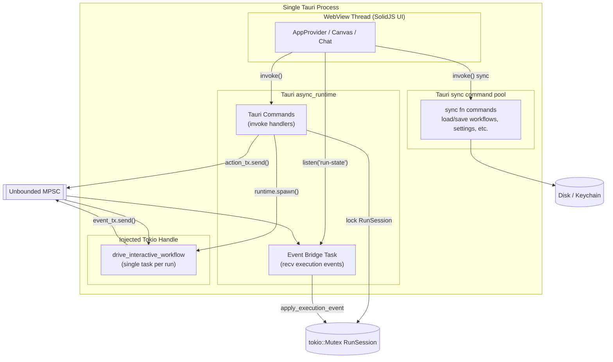
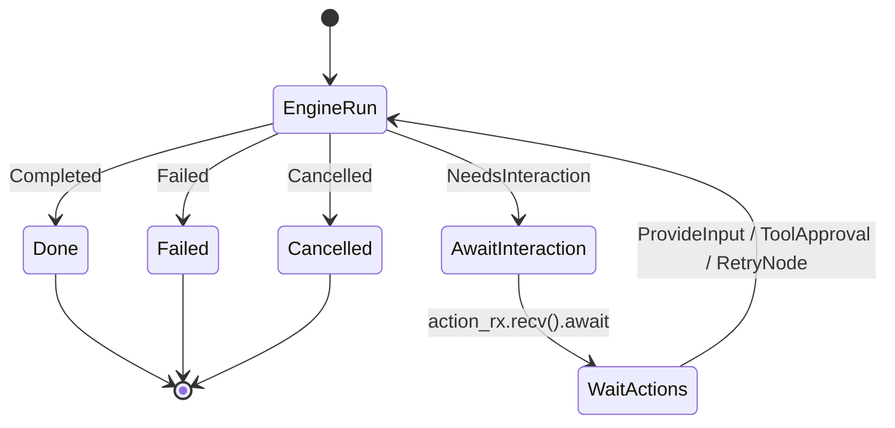
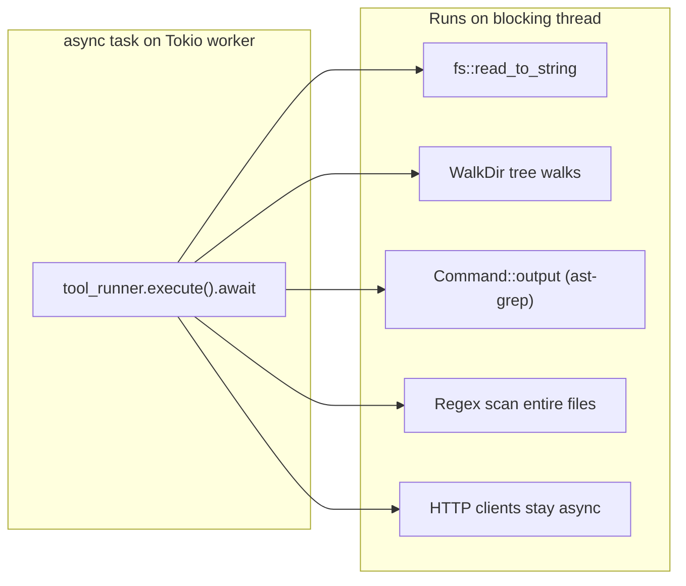
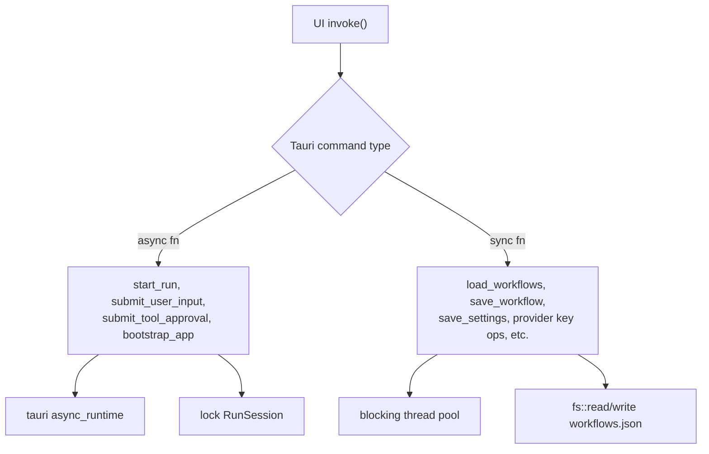
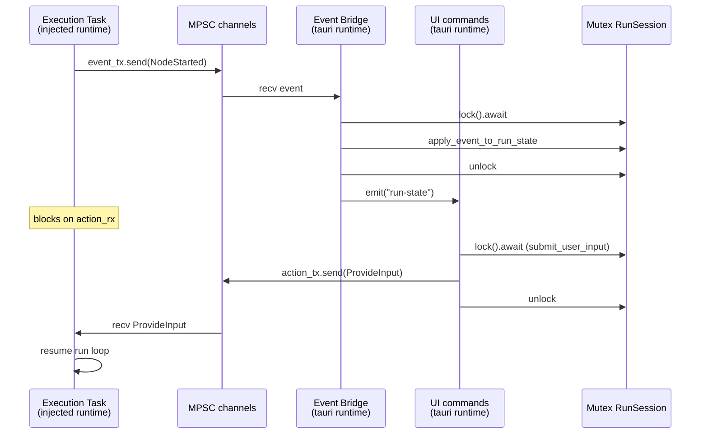
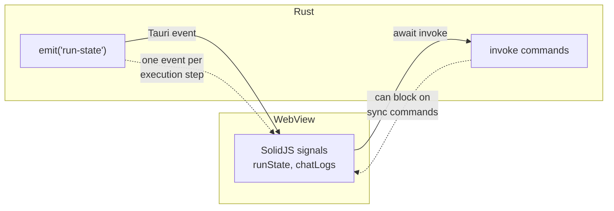
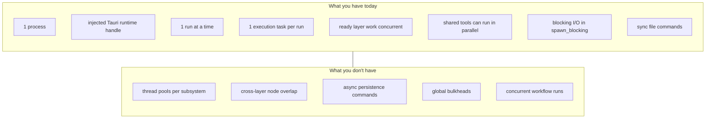

# Threading and concurrency

How async tasks, runtimes, and I/O interact in OpenFlow, and where the current design creates risk or limits throughput.

Related: [`contract.md`](contract.md)

## Executive summary

This app is **not heavily threaded**. In the desktop app, orchestration uses the Tauri Tokio runtime handle. Tests can still construct `AppBackend` with an owned Tokio runtime through `AppBackend::new(...)`. Each workflow run has one execution task. Within a DAG layer, ready AI calls and tool batches run concurrently via `FuturesUnordered`; completions apply to engine state one at a time. Shared tools may also batch in parallel under `ToolPortImpl`. The main risks are:

1. **Runtime split outside Tauri** when tests or helper entry points construct `AppBackend` with a separate owned runtime.
2. **Blocking I/O coverage** that depends on dispatching filesystem and subprocess work through `spawn_blocking`.
3. **Layer-bounded concurrency** — independent nodes only overlap while they share a ready layer; later layers still wait.
4. **A single active-run mutex** around live run state.
5. **Many sync Tauri commands** doing filesystem or settings I/O on the command thread pool.

Tool execution has per-tool semaphores for `ToolConcurrency::Exclusive`, but workflow runs themselves are still single-active-run.

---

## Process & runtime topology

Everything runs in **one Tauri desktop process**. In production, desktop injects `tauri::async_runtime::handle()` into `AppBackend::with_runtime_handle()`, and workflow execution is spawned from that handle.



### Where each runtime lives

| Component | Runtime | File |
| --- | --- | --- |
| Workflow execution task | injected `tokio::runtime::Handle` | `crates/orchestration/src/backend/mod.rs`, `crates/orchestration/src/run/execution/mod.rs` |
| Tauri commands + event fanout | `tauri::async_runtime` | `crates/desktop/src/lib.rs` |
| Sync file commands | Tauri blocking pool | `crates/desktop/src/lib.rs` |

`AppBackend::with_runtime_handle()` uses the runtime handle passed by desktop. Tests can still create an owned `tokio::runtime::Runtime` and pass its handle into `AppBackend::new(...)`.

Workflow runs are spawned by `spawn_interactive_workflow_run()` (`crates/orchestration/src/run/execution/mod.rs`).

The event bridge runs on Tauri's runtime in `start_run()` (`crates/desktop/src/lib.rs`), which spawns a task on `tauri::async_runtime` to recv execution events, apply them to run state, and emit `run-state` to the UI.

### Issue: runtime split outside the desktop path

In the desktop path, the same Tauri runtime handle is used for command tasks and run execution. In tests or bespoke non-Tauri entry points, `AppBackend` may still be constructed with a separate owned runtime. That split is useful for local construction, but it should not become the production path.

**Recommendation direction:** Keep desktop execution on the injected Tauri runtime handle. Avoid adding production code paths that construct their own runtime around `AppBackend`.

---

## Workflow execution model (one task, concurrent layer work)

Each run is a **single async task**. Inside that task, `InteractiveEngine::run()` drives a `FuturesUnordered` of ready work: model invocations and tool batches for all nodes currently runnable in the layer. Completions are applied serially as they arrive. Within one tool batch, `ToolPortImpl` can run adjacent `ToolConcurrency::Shared` tools in parallel and serializes `ToolConcurrency::Exclusive` tools with per-tool semaphores.



The host loop lives in `drive_interactive_workflow()` (`crates/orchestration/src/run/execution/drive.rs`). It calls `InteractiveEngine::run()`, which invokes `AiPort` and `ToolPort` internally until it completes, fails, or returns `NeedsInteraction`.

### Layer parallelism (implemented)

`execution_layers()` groups nodes by dependency depth. When a layer is active, `InteractiveEngine` schedules every ready AI call and tool batch into one `FuturesUnordered` pool (`crates/engine/src/execution/interactive_engine/mod.rs`). Independent nodes in the same layer therefore overlap in wall time; state updates remain single-threaded on completion.

### Issue: subagents block the whole run

Subagent execution is a **nested loop inside the same task**, sharing `ai`, `tool_runner`, and channels. A slow subagent blocks everything else in that run.

---

## Blocking I/O coverage

`ToolRunner` and `RunCoordinator` use **`spawn_blocking`** for search/find/write/edit/patch, local reads, preview/git/revert, execution cwd resolution, and large artifact spills. Desktop and orchestration share one **injected Tokio `Handle`** (Tauri runtime in production).

`ToolRunner::execute` is `async`, and concrete local filesystem or subprocess work should stay inside blocking tasks:



Examples from `crates/orchestration/src/tool/dispatch.rs` and `crates/orchestration/src/run/coordinator/mod.rs`:

- `fs::read_to_string`, `fs::read_dir`, `fs::metadata` - sync
- `WalkDir` over large trees - sync
- `Command::new("ast-grep").output()` - sync subprocess wait
- `search()` - reads every file, regex every line - sync

### Impact

During a large `search` or `find` tool call, the blocking closure can still consume blocking-pool capacity:

1. The run task waits for the blocking work to finish.
2. Other blocking tasks can queue behind long file scans or subprocess calls.
3. UI commands that also need blocking-pool work can feel delayed.

`read_url` uses async HTTP. Local filesystem and subprocess tools should continue to use `spawn_blocking`.

---

## Tauri command threading

Most commands are **synchronous `fn`**, not `async fn`:



Sync commands call straight into orchestration stores (`crates/orchestration/src/adapters/storage/`).

### Impact

- Saving workflows while a run is active competes for disk I/O on a blocking pool thread - usually fine, but large files can delay command responses.
- Provider API key load/save reads and writes `settings.json` synchronously.
- UI awaits `invoke()` - long sync commands make the app feel frozen.

Only a handful of commands are `async fn`. The rest block a Tauri worker.

---

## Run session locking & channels

All run lifecycle state sits behind one mutex:



### Issues

| Issue | Detail |
| --- | --- |
| **Single mutex** | Every event apply + every user input + every approval contends on `run_session` |
| **Clone on hot path** | `apply_execution_event` clones full `Workflow` and `WorkflowRunState` each event |
| **Unbounded channels** | `unbounded_channel()` - fast event bursts can grow memory without backpressure |
| **Single active run** | New `start_run` aborts previous handle - no concurrent runs |

---

## UI ↔ backend boundary

The UI is single-threaded (SolidJS in WebView). It does not spawn threads. Concurrency pain shows up as **IPC latency** and **event delivery**:



`useRunSession` (via `context/appProvider/`) listens for `run-state` events and updates run signals. Each execution step (node start, tool call, chat message) triggers a full state snapshot emit. High-frequency tool loops mean many serializations and IPC round-trips.

---

## Tool concurrency controls

`ToolConcurrency` lives in the engine tool model (`crates/engine/src/tools/config.rs`). Builtin tools are registered as either `Shared` or `Exclusive` in `crates/orchestration/src/tool/registry.rs`.

`ToolPortImpl` runs adjacent shared tools in parallel. Exclusive tools acquire a per-tool `tokio::sync::Semaphore` before execution (`crates/orchestration/src/run/execution/tool_port.rs`). This protects tools such as write, edit, bash, and apply-patch from running concurrently with the same tool name inside a run.

This is not a full bulkhead model. It does not cap all provider calls, all read tools, or all workflow runs globally.

---

## Issue severity matrix

| Priority | Issue | Symptom |
| --- | --- | --- |
| **P0** | Long blocking filesystem or subprocess tasks | UI commands can wait behind search/find/ast-grep on large repos |
| **P1** | Non-Tauri owned runtime path | Extra runtime split if production code accidentally constructs `AppBackend` around its own runtime |
| **P1** | Sync Tauri commands for persistence | Invoke hangs on save/load during heavy I/O |
| **P2** | Subagents in nested loop, same task | Parent node frozen while subagent runs |
| **P2** | Unbounded event channel | Memory growth on chatty runs |
| **P3** | Tool semaphores are per tool name and per run | No global cap across runs or providers |

---

## Recommended directions (not implemented)

These are architectural options, not a mandate.

### A. Keep production on one runtime

- Continue injecting `tauri::async_runtime::handle()` in desktop.
- Keep any non-Tauri `AppBackend` construction clearly scoped to tests or explicit helper entry points.

### B. Keep blocking work off async workers

```rust
// Pattern for local filesystem and subprocess work.
tokio::task::spawn_blocking(move || {
    // fs, WalkDir, Command::output
})
.await?
```

### C. Tune layer concurrency (already parallel)

- Ready nodes in a layer already share one `FuturesUnordered` pool.
- Follow-ups: caps on concurrent provider calls, fairer event ordering under load, or isolating per-node cancellation without draining siblings.

### D. Async persistence commands

- Convert sync `fn` Tauri handlers to `async fn`
- Use `tokio::fs` or `spawn_blocking` for file stores

### E. Backpressure on events

- Replace `unbounded_channel` with `bounded_channel(N)`
- Or batch events before emit to reduce IPC churn

### F. Broaden tool concurrency limits

- Add global caps for expensive read tools if large repositories starve the blocking pool.
- Cap concurrent provider calls if multi-node layers saturate upstream rate limits.

---

## Mental model



---

## Key file reference

| Concern | File |
| --- | --- |
| Runtime handle and backend facade | `crates/orchestration/src/backend/mod.rs` |
| Execution loop + spawn | `crates/orchestration/src/run/execution/mod.rs`, `crates/orchestration/src/run/execution/drive.rs` |
| Sequential engine | `crates/engine/src/execution/interactive_engine/` |
| Tool concurrency and semaphores | `crates/orchestration/src/run/execution/tool_port.rs`, `crates/orchestration/src/tool/registry.rs` |
| Blocking tool I/O | `crates/orchestration/src/tool/dispatch.rs`, `crates/orchestration/src/tool/runner.rs` |
| Sync file persistence | `crates/orchestration/src/adapters/storage/` |
| Tauri command + event bridge | `crates/desktop/src/lib.rs` |
| UI event listener | `crates/ui/src/context/appProvider/useRunSession.ts` |
