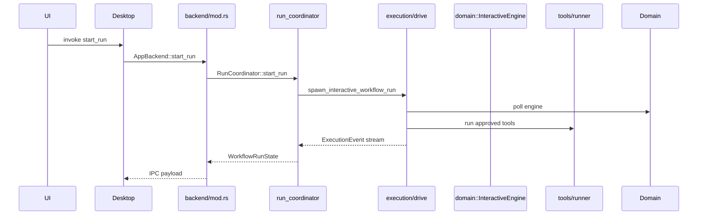

# Orchestration crate layout

`crates/orchestration/src` is grouped by **glossary entity** (workflow, agent, project, run, settings, template, skill), then by **hexagonal role** inside each entity.

Rust import paths match the folder layout (e.g. `orchestration::workflow::catalog`, `orchestration::run::execution`).

---

## Module paths

| What you see on disk | What Rust sees in code |
| --- | --- |
| `workflow/catalog.rs` | `orchestration::workflow::catalog` |
| `run/coordinator.rs` | `orchestration::run::coordinator` |
| `adapters/tool_impl/` | `orchestration::tools` (internal alias) |

---

## Hexagonal roles

```text
                    desktop / ui (inbound)
                           │
                    ┌──────▼──────┐
                    │   backend/   │  composition root — wires services
                    └──────┬──────┘
                           │
     ┌─────────────────────┼─────────────────────┐
     ▼                     ▼                     ▼
 workflow/              run/                settings/
 application/         application/          application/
 (service)            (service)             (service)
     │                     │                     │
     ▼                     ▼                     ▼
 adapters/            state/               adapters/
 (repository)      (session snapshot)     (repository)
                           │
                           ▼
              adapters/infrastructure/
              tools · lsp · git (runtime I/O)
                           │
                           ▼
                      domain + providers
```

| Role | Folder suffix | Job |
| --- | --- | --- |
| **Service** | `{entity}/application/` | Coordinate domain + stores for one use case. No raw file-format or HTTP details. |
| **Repository** | `{entity}/adapters/` | Load/save JSON, hide paths (`workflows.json`, `.flow/workflows/`, etc.). |
| **Session state** | `run/state/` | Live run snapshot for UI (`WorkflowRunState`, trace, approvals). |
| **Infrastructure** | `adapters/infrastructure/` | Shared runtime I/O during runs (tools, LSP format, git diff). |
| **Composition** | `backend/` | Construct services, expose IPC surface to desktop. |
| **Shared DTOs** | `api.rs`, `error.rs` (crate root) | Transport shapes and `BackendError` used across entities. |

Domain semantics stay in `crates/engine`. Orchestration wires and persists.

---

## Directory map

```text
orchestration/src/
├── lib.rs                 # #[path] module wiring + domain re-exports
├── api.rs                 # IPC DTOs (WorkflowListItem, ProviderReadiness, …)
├── error.rs               # BackendError
│
├── backend/
│   └── mod.rs             # AppBackend — delegates to entity services
│
├── workflow/
│   ├── application/
│   │   └── catalog.rs     # WorkflowCatalog — merge, assign, CRUD rules
├── adapters/
│   └── storage/
│       ├── app_workflow_store.rs     # FileWorkflowStore — app workflows.json
│       └── project_workflow_store.rs # FileProjectWorkflowStore — .flow/workflows/
│
├── agent/
│   ├── application/
│   │   └── library.rs     # AgentLibrary — saved agent CRUD, create_agent_node
│   └── adapters/
│       └── store.rs       # FileAgentStore — openflow/agents.json
│
├── project/
│   ├── application/
│   │   └── registry.rs    # ProjectRegistry — create/load projects
│   └── adapters/
│       └── store.rs       # FileProjectStore — openflow/projects.json
│
├── run/
│   ├── application/
│   │   ├── coordinator.rs # RunCoordinator — start/stop, approvals, channels
│   │   └── execution/     # drive loop, event projection, headless tests
│   └── state/
│       └── mod.rs         # WorkflowRunState — UI-facing run snapshot
│
├── settings/
│   ├── application/
│   │   └── facade.rs      # SettingsFacade — keys, skills, validation summaries
│   └── adapters/
│       ├── store.rs       # FileSettingsStore — settings.json
│       └── provider_config.rs  # API key resolution, provider readiness
│
├── template/
│   └── store.rs           # FileTemplateStore — openflow/templates.json
│
├── skill/
│   └── store.rs           # Skill discovery (read-only filesystem scan)
│
└── adapters/infrastructure/
    ├── tools/             # registry, runner, edit/hashline engine
    ├── lsp/               # format-on-write, diagnostics append
    └── git/               # scoped diff / revert during runs
```

---

## Entity reference

### Workflow

| File | Module path | Responsibility |
| --- | --- | --- |
| `workflow/catalog.rs` | `workflow::catalog` | Merge app + project workflows; assign/unassign to projects; rename/split rules |
| `adapters/storage/app_workflow_store.rs` | `adapters::storage::app_workflow_store` | Persist app-level `workflows.json` |
| `adapters/storage/project_workflow_store.rs` | `adapters::storage::project_workflow_store` | Discover and save per-project workflow files |

Catalog owns merge policy. Stores only read/write bytes.

### Agent

| File | Module path | Responsibility |
| --- | --- | --- |
| `agent/application/library.rs` | `agent_library` | Callable agent library operations |
| `agent/adapters/store.rs` | `agent_store` | `agents.json` persistence |

### Project

| File | Module path | Responsibility |
| --- | --- | --- |
| `project/application/registry.rs` | `project_registry` | Register folders as projects |
| `project/adapters/store.rs` | `project_store` | `projects.json` + workflow membership rows |

### Run

| File | Module path | Responsibility |
| --- | --- | --- |
| `run/application/coordinator.rs` | `run_coordinator` | Active session mutex; `start_run`, `submit_*`, `stop_run` |
| `run/application/execution/` | `execution` | Host loop: `InteractiveEngine`, tool runner, telemetry → events |
| `run/state/mod.rs` | `state` | `WorkflowRunState` projected for UI and IPC |

Only `run/application/` invokes `InteractiveEngine` / `WorkflowRunner` (see [architecture contract](../../architecture/contract.md)).

### Settings

| File | Module path | Responsibility |
| --- | --- | --- |
| `settings/application/facade.rs` | `settings_facade` | Settings UX backend: redaction, skill list, workflow validation summary |
| `settings/adapters/store.rs` | `settings_store` | `settings.json` load/save |
| `settings/adapters/provider_config.rs` | `provider_config` | Key precedence: transient → stored → env |

### Template & skill

Adapter-only today — no separate `application/` layer yet.

| File | Module path | Responsibility |
| --- | --- | --- |
| `template/store.rs` | `template_store` | Node template persistence |
| `skill/store.rs` | `skill_store` | Scan configured roots for `SKILL.md` files |

### Infrastructure (shared at run time)

Used by `execution` and `run_coordinator`, not tied to one entity.

| Folder | Module path | Responsibility |
| --- | --- | --- |
| `adapters/infrastructure/tools/` | `tools` | Builtin tool registry, `ToolRunner`, file edit engine |
| `adapters/infrastructure/lsp/` | `lsp` | Post-write formatters (`rustfmt`, `prettier`, …) |
| `adapters/infrastructure/git/` | `git` | Execution-cwd-scoped `git diff` / batch revert |

---

## Request flow (example: start run)



`AppBackend` does not embed run logic. It forwards to `RunCoordinator`.

---

## Where to add code

| Change | Put it here |
| --- | --- |
| New workflow merge rule | `workflow/application/catalog.rs` |
| New workflow file layout | `workflow/adapters/` |
| New run lifecycle step | `run/application/coordinator.rs` or `execution/` |
| New UI run field | `run/state/mod.rs` + domain telemetry if needed |
| New builtin tool | `adapters/infrastructure/tools/` |
| New settings field | `settings/adapters/store.rs` schema + `settings/application/facade.rs` if UX-facing |
| New desktop command | Delegate in `backend/mod.rs`; implement in the right entity `application/` |

### Import rules (orchestration internal)

| Layer | May import |
| --- | --- |
| `backend/` | any entity `application/`, `api`, `error` |
| `{entity}/application/` | `engine`, same-entity `adapters/`, `adapters/infrastructure/*` |
| `{entity}/adapters/` | `engine`, I/O crates |
| `adapters/infrastructure/` | `engine`, I/O crates |

Avoid: entity `adapters/` calling another entity's `application/`. Cross-entity work goes through services or `backend/`.

---

## Persistence locations (quick reference)

| Store module | On-disk path |
| --- | --- |
| `app_workflow_store` | `{data_local}/openflow/workflows.json` |
| `project_workflow_store` | `{project}/.flow/workflows/{id}.workflow.json` |
| `agent_store` | `{data_local}/openflow/agents.json` |
| `project_store` | `{data_local}/openflow/projects.json` |
| `settings_store` | `{data_local}/openflow/settings.json` |
| `template_store` | `{data_local}/openflow/templates.json` |

---

## Related docs

- [Orchestration section overview](README.md) — what the crate does and why
- [Architecture contract](../../architecture/contract.md) — layer boundaries
- [AGENTS.md](../../../AGENTS.md) — repo map and common change paths
- [.cursor/skills/rust-hexarc-organizer/SKILL.md](../../../.cursor/skills/rust-hexarc-organizer/SKILL.md) — full hexarc placement guide
