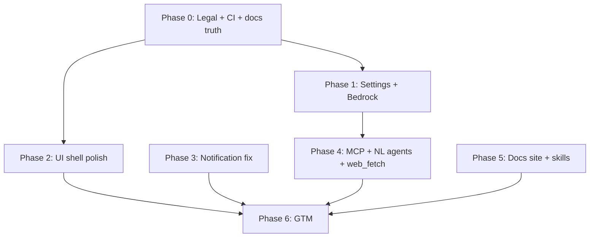

# Public Release Readiness Implementation Plan

> **For agentic workers:** REQUIRED SUB-SKILL: Use superpowers:subagent-driven-development (recommended) or superpowers:executing-plans to implement this plan task-by-task. Steps use checkbox (`- [ ]`) syntax for tracking.

**Goal:** Ship a publicly shareable OpenFlow desktop app with consolidated settings, polished editor shell, Bedrock + MCP provider/tool support, accurate docs, working CI, and a minimal go-to-market package.

**Architecture:** Work in dependency order: legal/CI/docs truth first, then settings/providers, then UI shell polish, then reliability fixes, then net-new features (Bedrock, MCP, NL agents, web search). Each phase produces independently testable software. Reuse existing detailed plans where they exist — do not duplicate their task lists here; execute them as sub-plans.

**Tech Stack:** Rust (engine, orchestration, providers, desktop), SolidJS UI, Tauri v2, GitHub Actions, GitHub Pages (docs site), Vitest, `./scripts/verify.sh`.

---

## Scope Map


| Area                                 | Priority | Status                                          | Sub-plan / notes                                                                                                                     |
| ------------------------------------ | -------- | ----------------------------------------------- | ------------------------------------------------------------------------------------------------------------------------------------ |
| Settings consolidation + auto-save   | P0       | Fragmented (5 sections, manual save)            | This plan Phase 1                                                                                                                    |
| Bedrock provider                     | P0       | Not started (explicitly deferred in spec tests) | This plan Phase 1                                                                                                                    |
| MCP integration                      | P0       | Plan only                                       | `[2026-06-15-mcp-external-tools.md](2026-06-15-mcp-external-tools.md)`                                                               |
| Input notification bug               | P0       | Shipped but wrong (`is_initial` ignored)        | This plan Phase 3                                                                                                                    |
| CI parity with verify.sh             | P0       | CI weaker than local gate                       | This plan Phase 0                                                                                                                    |
| Documentation accuracy               | P0       | Stale (`domain`→`engine`, keychain claims)      | This plan Phase 0                                                                                                                    |
| Legal / contribution files           | P0       | Missing LICENSE, SECURITY, CONTRIBUTING         | This plan Phase 0                                                                                                                    |
| Left sidebar hide (desktop)          | P1       | CSS exists, unwired                             | This plan Phase 2 + `[2026-06-20-phase-1-ui-hierarchy-responsive-palette.md](2026-06-20-phase-1-ui-hierarchy-responsive-palette.md)` |
| Full-width top bar + tooltips        | P1       | Partial                                         | This plan Phase 2                                                                                                                    |
| Run button sizing                    | P1       | Too tall vs readiness chip                      | Phase 1 UI plan                                                                                                                      |
| Hide projects / shortcuts → settings | P1       | Not implemented                                 | This plan Phase 2                                                                                                                    |
| Remove zoom % display                | P1       | Shown in sidebar footer popup                   | This plan Phase 2                                                                                                                    |
| Homepage / empty start               | P1       | Auto-creates "Workflow 1"                       | This plan Phase 2                                                                                                                    |
| Dock fullscreen (all tabs)           | P1       | Chat-only focus mode                            | This plan Phase 2                                                                                                                    |
| Agents table typography + help text  | P1       | No semantic headings                            | Phase 2 UI plan + this plan                                                                                                          |
| NL agent creation                    | P2       | Workflow NL exists; agents form-only            | This plan Phase 4                                                                                                                    |
| Web/internet search tool             | P2       | Only ripgrep `search` exists                    | `[2026-06-15-browser-tool.md](2026-06-15-browser-tool.md)` or minimal fetch tool                                                     |
| Workflow insights                    | P3       | Deferred                                        | Backlog only                                                                                                                         |
| Demo video + GTM                     | P3       | Not started                                     | This plan Phase 6 (outline)                                                                                                          |
| Dependabot + PR bots                 | P1       | Not configured                                  | This plan Phase 0                                                                                                                    |


---

## File Structure (new / modified by phase)


| File                                               | Phase | Responsibility                                  |
| -------------------------------------------------- | ----- | ----------------------------------------------- |
| `LICENSE`                                          | 0     | MIT or chosen OSS license                       |
| `SECURITY.md`                                      | 0     | Vulnerability reporting                         |
| `CONTRIBUTING.md`                                  | 0     | Pointer to `docs/contributing/`                 |
| `.github/workflows/ci.yml`                         | 0     | Run `./scripts/verify.sh`                       |
| `.github/dependabot.yml`                           | 0     | Rust + npm dependency PRs                       |
| `.github/workflows/pr-labeler.yml`                 | 0     | Optional: enforce PR title/body                 |
| `docs/contributing/coding-patterns.md`             | 0     | Fix `domain`→`engine` paths                     |
| `docs/glossary.md`, `docs/ROADMAP.md`              | 0     | Same path fixes                                 |
| `README.md`                                        | 0     | Accurate key storage, install, dev commands     |
| `docs/site/` or `.github/workflows/pages.yml`      | 5     | GitHub Pages docs                               |
| `crates/ui/src/settings/types.ts`                  | 1     | Collapse section IDs                            |
| `crates/ui/src/settings/ProvidersSection.tsx`      | 1     | New merged auth+provider+reasoning+models       |
| `crates/ui/src/settings/GeneralSection.tsx`        | 1     | Sidebar prefs, shortcuts link, auto-save toggle |
| `crates/ui/src/context/AppProvider.tsx`            | 1,2,3 | Auto-save debounce, sidebar hide state          |
| `crates/ui/src/lib/panelVisibility/index.ts`       | 2     | Add `leftPanelHidden`, `projectsHidden`         |
| `crates/ui/src/components/AppHeader/AppHeader.tsx` | 2     | Full-width bar, sidebar toggle, tooltips        |
| `crates/ui/src/screens/HomeScreen.tsx`             | 2     | Landing when no workflow selected               |
| `crates/providers/src/bedrock.rs`                  | 1     | AWS Bedrock Converse API adapter                |
| `crates/providers/src/spec.rs`                     | 1     | `bedrock` ProviderSpec                          |
| `crates/desktop/src/run_notifications.rs`          | 3     | Skip `is_initial` notifications                 |
| `crates/orchestration/src/agent/authoring/`        | 4     | NL agent creation (mirror workflow authoring)   |
| `.cursor/skills/openflow-contributing/SKILL.md`    | 5     | Repo-specific contribution skill                |


---

## Phase 0 — Repo Hygiene & CI (blockers)

Ship first. Nothing public without these.

### Task 0: Add legal and contribution entrypoints

**Files:**

- Create: `LICENSE`
- Create: `SECURITY.md`
- Create: `CONTRIBUTING.md`

- [x] **Step 1: Add MIT LICENSE**

Create `LICENSE` with standard MIT text and copyright holder name.

- [x] **Step 2: Add SECURITY.md**

```markdown
# Security Policy

Report vulnerabilities privately via GitHub Security Advisories or email [your-email].

Do not open public issues for security bugs.
```

- [x] **Step 3: Add CONTRIBUTING.md**

```markdown
# Contributing

Start at `[docs/contributing/README.md](docs/contributing/README.md)`.

Run `./scripts/verify.sh` before opening a PR.
```

- [x] **Step 4: Commit**

```bash
git add LICENSE SECURITY.md CONTRIBUTING.md
git commit -m "docs: add LICENSE, SECURITY, and CONTRIBUTING entrypoints"
```

### Task 1: Align CI with verify.sh

**Files:**

- Modify: `.github/workflows/ci.yml`

- [ ] **Step 1: Write failing expectation**

Current CI runs `cargo clippy --workspace --all-targets` without `-D warnings` and skips UI steps entirely. A PR that breaks `npm --prefix crates/ui run typecheck` can merge today.

- [ ] **Step 2: Replace verify job with full gate**

```yaml
  verify:
    name: Verify (blocking)
    runs-on: ubuntu-latest
    steps:
      - uses: actions/checkout@v4

      - name: Install Rust toolchain
        uses: dtolnay/rust-toolchain@stable
        with:
          components: rustfmt, clippy

      - name: Install Node
        uses: actions/setup-node@v4
        with:
          node-version: "22"
          cache: npm
          cache-dependency-path: |
            crates/ui/package-lock.json
            crates/desktop/package-lock.json

      - name: Install npm dependencies
        run: |
          npm ci --prefix crates/ui
          npm ci --prefix crates/desktop

      - name: Install cargo tools
        run: |
          cargo install cargo-deny cargo-machete typos-cli --locked 2>/dev/null || true

      - name: Cache Rust build artifacts
        uses: swatinem/rust-cache@v2

      - name: Run verification gate
        run: ./scripts/verify.sh
```

- [ ] **Step 3: Run locally**

Run: `./scripts/verify.sh`
Expected: PASS (fix any pre-existing failures before merging CI change)

- [ ] **Step 4: Commit**

```bash
git add .github/workflows/ci.yml
git commit -m "ci: run full verify.sh gate including UI checks"
```

### Task 2: Add Dependabot

**Files:**

- Create: `.github/dependabot.yml`

- [ ] **Step 1: Create dependabot config**

```yaml
version: 2
updates:
  - package-ecosystem: cargo
    directory: "/"
    schedule:
      interval: weekly
    open-pull-requests-limit: 5

  - package-ecosystem: npm
    directory: "/crates/ui"
    schedule:
      interval: weekly
    open-pull-requests-limit: 3

  - package-ecosystem: npm
    directory: "/crates/desktop"
    schedule:
      interval: weekly
    open-pull-requests-limit: 3

  - package-ecosystem: github-actions
    directory: "/"
    schedule:
      interval: monthly
```

- [ ] **Step 2: Commit**

```bash
git add .github/dependabot.yml
git commit -m "ci: add dependabot for cargo, npm, and actions"
```

### Task 3: Fix documentation drift (domain → engine)

**Files:**

- Modify: `docs/contributing/coding-patterns.md`
- Modify: `docs/glossary.md`
- Modify: `docs/architecture/threading-concurrency.md`
- Modify: `docs/ROADMAP.md` (path references only — do not rewrite backlog)
- Modify: `README.md`
- Modify: `crates/ui/AGENTS.md` (React → SolidJS primary)

- [ ] **Step 1: Bulk replace stale paths**

Run:

```bash
rtk grep -l 'crates/domain' docs/ crates/ui/AGENTS.md README.md
```

Replace every `crates/domain` with `crates/engine`. Replace `backend.rs` references with `backend/mod.rs` where applicable.

- [ ] **Step 2: Fix API key storage claim in README**

In `README.md`, replace any "OS keychain" or "credential store" language with:

> Provider API keys are stored in `{data_local}/openflow/settings.json`. Use env vars (`OPENAI_API_KEY`, `ANTHROPIC_API_KEY`, etc.) for CI and headless runs.

- [ ] **Step 3: Update docs/README.md index**

Add links to `docs/contributing/development-lanes.md`, `docs/architecture/run-persistence.md`, `docs/ROADMAP.md`.

- [ ] **Step 4: Commit**

```bash
git add docs/ README.md crates/ui/AGENTS.md
git commit -m "docs: fix engine paths and accurate key storage story"
```

---

## Phase 1 — Settings & Providers

Consolidate fragmented settings. Add Bedrock for work use.

### Task 4: Merge settings sections into Providers + General

**Files:**

- Modify: `crates/ui/src/settings/types.ts`
- Create: `crates/ui/src/settings/ProvidersSection.tsx`
- Create: `crates/ui/src/settings/GeneralSection.tsx`
- Modify: `crates/ui/src/screens/SettingsScreen.tsx`
- Delete (after merge): `AuthSection.tsx`, `ProviderSection.tsx`, `ReasoningSection.tsx`, `ModelsSection.tsx`

- [x] **Step 1: Write failing test for new section IDs**

Create `crates/ui/src/settings/types.test.ts`:

```typescript
import { describe, expect, it } from "vitest";
import { SETTINGS_SECTIONS } from "./types";

describe("SETTINGS_SECTIONS", () => {
  it("exposes consolidated provider and general sections", () => {
    const ids = SETTINGS_SECTIONS.map((s) => s.id);
    expect(ids).toEqual(["appearance", "providers", "general"]);
  });
});
```

- [x] **Step 2: Run test to verify it fails**

Run: `npm --prefix crates/ui run test -- src/settings/types.test.ts`
Expected: FAIL — current IDs include `authentication`, `provider`, `reasoning`, `models`

- [x] **Step 3: Update types and build ProvidersSection**

`types.ts`:

```typescript
export type SettingsSectionId = "appearance" | "providers" | "general";

export const SETTINGS_SECTIONS = [
  { id: "appearance", label: "Appearance" },
  { id: "providers", label: "Providers & models" },
  { id: "general", label: "General" },
] as const;
```

`ProvidersSection.tsx` — single scrollable card with subheadings (use `<h3 class="settings-subheading">`):

1. **Active provider** — provider picker (from old `ProviderSection`)
2. **Authentication** — API key field + env-var hint (from `AuthSection`)
3. **Connection** — base URL, transport, paths (read-only except `custom_openai_compatible`)
4. **Reasoning defaults** — effort + budget (from `ReasoningSection`, hidden when profile has no options)
5. **Models** — known models list + default model picker (from `ModelsSection`)

Import existing handlers from `AppProvider` via `useApp()` — no new IPC.

- [ ] **Step 4: Build GeneralSection**

`GeneralSection.tsx` subsections:

- **Editor** — "Hide projects in sidebar" toggle → new `AppSettings.ui.hideProjectsInSidebar` (or localStorage `openflow.hideProjects`)
- **Keyboard shortcuts** — link/button opens `ShortcutsModal` (moved from sidebar footer)
- **Auto-save** — toggle `AppSettings.auto_save_settings` (default `true` after this task)

Remove Shortcuts button from `AppSidebar.tsx` footer.

- [x] **Step 5: Wire SettingsScreen and run tests**

Run: `npm --prefix crates/ui run test -- src/settings/`
Expected: PASS

- [x] **Step 6: Commit**

```bash
git add crates/ui/src/settings/ crates/ui/src/screens/SettingsScreen.tsx crates/ui/src/components/sidebar/AppSidebar.tsx
git commit -m "feat(ui): consolidate settings into providers and general sections"
```

### Task 5: Settings auto-save

**Files:**

- Modify: `crates/orchestration/src/settings/model.rs`
- Modify: `crates/ui/src/context/AppProvider.tsx`
- Modify: `crates/ui/src/lib/types.ts`

- [ ] **Step 1: Add auto_save_settings to Rust model**

In `crates/orchestration/src/settings/model.rs`:

```rust
#[derive(Debug, Clone, Serialize, Deserialize)]
#[serde(default)]
pub struct AppSettings {
    // ... existing fields ...
    pub auto_save_settings: bool,
}

impl Default for AppSettings {
    fn default() -> Self {
        Self {
            // ...
            auto_save_settings: true,
        }
    }
}
```

Add inline test:

```rust
#[test]
fn auto_save_settings_defaults_true() {
    let settings: AppSettings = serde_json::from_str("{}").unwrap();
    assert!(settings.auto_save_settings);
}
```

- [ ] **Step 2: Run test**

Run: `cargo test -p orchestration auto_save_settings_defaults_true -- --nocapture`
Expected: PASS

- [ ] **Step 3: Debounced save in AppProvider**

In `AppProvider.tsx`, after `updateSettings` mutates in-memory state:

```typescript
let saveTimer: ReturnType<typeof setTimeout> | undefined;

const scheduleAutoSave = () => {
  if (!settings().auto_save_settings) return;
  clearTimeout(saveTimer);
  saveTimer = setTimeout(() => {
    void handleSaveSettings();
  }, 800);
};
```

Call `scheduleAutoSave()` at end of `updateSettings`. Keep explicit Save button and ⌘S as immediate save.

- [ ] **Step 4: Mirror type in UI**

Add `auto_save_settings?: boolean` to `AppSettings` in `crates/ui/src/lib/types.ts`.

- [ ] **Step 5: Commit**

```bash
git add crates/orchestration/src/settings/model.rs crates/ui/src/context/AppProvider.tsx crates/ui/src/lib/types.ts
git commit -m "feat: auto-save settings with debounce when enabled"
```

### Task 6: Add AWS Bedrock provider

**Files:**

- Create: `crates/providers/src/bedrock.rs`
- Modify: `crates/providers/src/lib.rs`
- Modify: `crates/providers/src/spec.rs`
- Modify: `crates/providers/src/client.rs`
- Modify: `crates/providers/Cargo.toml` (add `aws-config`, `aws-sdk-bedrockruntime` — evaluate crate size; ponytail: start with Converse API only)

- [ ] **Step 1: Write failing spec test**

In `crates/providers/src/spec.rs` tests, change exclusion assertion:

```rust
#[test]
fn builtin_specs_include_bedrock() {
    let ids: Vec<_> = builtin_provider_specs()
        .iter()
        .map(|s| s.id.as_str())
        .collect();
    assert!(ids.contains(&"bedrock"));
}
```

Run: `cargo test -p providers builtin_specs_include_bedrock -- --nocapture`
Expected: FAIL

- [ ] **Step 2: Add ProviderSpec for bedrock**

In `spec.rs`, add entry:

```rust
ProviderSpec {
    id: ProviderId::new("bedrock"),
    label: "Amazon Bedrock",
    kind: ProviderKind::Bedrock,
    default_model: "anthropic.claude-3-5-sonnet-20241022-v2:0",
    known_models: vec![/* Claude + Titan ids */],
    auth: AuthSpec::Bedrock {
        env_var: "AWS_PROFILE", // optional; uses default credential chain
    },
    // ...
}
```

Add `ProviderKind::Bedrock` variant.

- [ ] **Step 3: Implement bedrock.rs**

Use AWS SDK `Converse` / `ConverseStream` against `bedrock-runtime`. Map `AgentRequest` ↔ Bedrock messages format (similar to anthropic.rs tool schema).

Auth: default AWS credential chain (`AWS_ACCESS_KEY_ID`, `AWS_PROFILE`, SSO, instance role).

- [ ] **Step 4: Wire create_provider dispatch**

In `client.rs`:

```rust
ProviderKind::Bedrock => bedrock::invoke(request, config).await,
```

- [ ] **Step 5: Run provider tests**

Run: `cargo test -p providers -- --nocapture`
Expected: PASS

- [ ] **Step 6: Commit**

```bash
git add crates/providers/
git commit -m "feat(providers): add AWS Bedrock Converse adapter"
```

---

## Phase 2 — UI Shell Polish

Execute `[2026-06-20-phase-1-ui-hierarchy-responsive-palette.md](2026-06-20-phase-1-ui-hierarchy-responsive-palette.md)` in parallel where it overlaps (run button sizing, palette tokens). This phase covers items not fully specified there.

### Task 7: Desktop left sidebar hide + full-width top bar

**Files:**

- Modify: `crates/ui/src/lib/panelVisibility/index.ts`
- Modify: `crates/ui/src/context/AppProvider.tsx`
- Modify: `crates/ui/src/App.tsx`
- Modify: `crates/ui/src/components/AppHeader/AppHeader.tsx`
- Modify: `crates/ui/src/styles/index.css`

- [ ] **Step 1: Write failing panel visibility test**

Extend `crates/ui/src/lib/panelVisibility/index.test.ts`:

```typescript
it("persists left panel hidden state", () => {
  writeLeftPanelHidden(true);
  expect(readLeftPanelHidden()).toBe(true);
});
```

- [ ] **Step 2: Run test — expect FAIL**

Run: `npm --prefix crates/ui run test -- src/lib/panelVisibility/`

- [ ] **Step 3: Implement left panel persistence**

In `panelVisibility/index.ts`, mirror right panel pattern:

```typescript
const LEFT_KEY = "openflow.leftPanelHidden";

export function readLeftPanelHidden(): boolean {
  return localStorage.getItem(LEFT_KEY) === "1";
}

export function writeLeftPanelHidden(hidden: boolean): void {
  localStorage.setItem(LEFT_KEY, hidden ? "1" : "0");
}
```

In `AppProvider.tsx`:

```typescript
const [leftPanelHidden, setLeftPanelHidden] = createSignal(readLeftPanelHidden());

const handleToggleLeftPanel = () => {
  const next = !leftPanelHidden();
  setLeftPanelHidden(next);
  writeLeftPanelHidden(next);
};
```

- [ ] **Step 4: Wire App.tsx grid**

When `leftPanelHidden()`:

```tsx
classList={{
  "app-shell--left-hidden": leftPanelHidden(),
}}
```

CSS:

```css
.app-shell--left-hidden {
  grid-template-columns: minmax(0, 1fr);
}

.topbar {
  grid-column: 1 / -1; /* full width above sidebar+main */
}
```

Move topbar outside sidebar column so it spans 100% width (Cursor-style).

- [ ] **Step 5: Add header toggle button (desktop + compact)**

In `AppHeader.tsx`, leading area:

```tsx
<button
  type="button"
  class="topbar-icon-button"
  title="Toggle sidebar (⌘B)"
  aria-pressed={!ctx.leftPanelHidden()}
  onClick={() => ctx.handleToggleLeftPanel()}
>
  <SidebarIcon name="panel-left" />
</button>
```

Register ⌘B / Ctrl+B in `AppProvider.tsx` keydown handler.

- [ ] **Step 6: Run tests + manual check**

Run: `npm --prefix crates/ui run test -- src/lib/panelVisibility/`
Expected: PASS

- [ ] **Step 7: Commit**

```bash
git add crates/ui/src/lib/panelVisibility/ crates/ui/src/context/ crates/ui/src/App.tsx crates/ui/src/components/AppHeader/ crates/ui/src/styles/index.css
git commit -m "feat(ui): hide left sidebar and full-width top bar"
```

### Task 8: Shrink run button + quiet readiness chip

**Files:**

- Modify: `crates/ui/src/styles/index.css` (`.topbar-primary-button`, `.readiness-chip`)
- Modify: `crates/ui/src/components/AppHeader/AppHeader.tsx`

- [ ] **Step 1: Write visual regression note**

No pixel test — document target: run button `min-height: 28px`, readiness chip same height, icon-only on compact when label is "Run".

- [ ] **Step 2: Update CSS**

```css
.topbar-primary-button,
.topbar-danger-button {
  min-height: 28px;
  padding: 0 10px;
  font-size: 13px;
}

.readiness-chip {
  min-height: 28px;
  padding: 0 10px;
  font-size: 12px;
}
```

Align with canvas "Add node" chip height (inspect `.canvas-add-node-button` and match).

- [ ] **Step 3: Commit**

```bash
git add crates/ui/src/styles/index.css crates/ui/src/components/AppHeader/AppHeader.tsx
git commit -m "fix(ui): shrink run button to match readiness chip height"
```

### Task 9: Hide projects + remove sidebar shortcuts/zoom popup

**Files:**

- Modify: `crates/ui/src/components/sidebar/AppSidebar.tsx`
- Modify: `crates/ui/src/context/AppProvider.tsx`
- Modify: `crates/ui/src/styles/index.css`

- [ ] **Step 1: Gate projects section**

```tsx
<Show when={!ctx.hideProjectsInSidebar()}>
  {/* existing projects section */}
</Show>
```

Wire `hideProjectsInSidebar` from settings or localStorage (Task 4 GeneralSection).

- [ ] **Step 2: Remove footer shortcuts button and zoom popup**

Delete from `AppSidebar.tsx` footer:

- Shortcuts `help` button (now in Settings → General)
- Zoom hover popup (`formatUiZoomLabel`) — keep ⌘+/−/0 shortcuts, remove visible percentage

- [ ] **Step 3: Commit**

```bash
git add crates/ui/src/components/sidebar/AppSidebar.tsx crates/ui/src/context/AppProvider.tsx
git commit -m "feat(ui): optional hide projects; move shortcuts to settings; drop zoom label"
```

### Task 10: Top bar icon tooltips + right panel expand semantics

**Files:**

- Modify: `crates/ui/src/components/AppHeader/AppHeader.tsx`
- Modify: `crates/ui/src/styles/index.css`

- [ ] **Step 1: Audit icon buttons missing title**

Add `title` to every icon-only button in header and dock tabs:


| Button            | title                   |
| ----------------- | ----------------------- |
| Left panel toggle | `Toggle sidebar (⌘B)`   |
| Right panel       | `Toggle inspector (⌘J)` |
| Workflow settings | `Workflow settings`     |
| Save              | `Save (⌘S)`             |
| Run               | `Run workflow (⌘Enter)` |
| Stop              | `Stop workflow (⌘.)`    |


- [ ] **Step 2: Swap right panel icon semantics**

When panel closed, use `panel-right-open` with title `Expand inspector`.
When open, use `panel-left-expand` or chevron-left icon with title `Collapse inspector`.

- [ ] **Step 3: Commit**

```bash
git add crates/ui/src/components/AppHeader/AppHeader.tsx crates/ui/src/panels/DockPanel.tsx
git commit -m "fix(ui): tooltips on icon buttons; clearer inspector toggle icon"
```

### Task 11: Homepage / welcome screen

**Files:**

- Create: `crates/ui/src/screens/HomeScreen.tsx`
- Modify: `crates/ui/src/App.tsx`
- Modify: `crates/ui/src/context/AppProvider.tsx`

- [ ] **Step 1: Write failing App routing test**

In `crates/ui/src/App.test.tsx`:

```typescript
it("shows home screen when no workflow is selected", () => {
  // render with selectedWorkflowId: null
  expect(screen.getByText(/Welcome to OpenFlow/i)).toBeInTheDocument();
});
```

- [ ] **Step 2: Implement HomeScreen**

Card grid with actions:

- **Open recent workflow** (list last 5 from sidebar state)
- **New workflow**
- **Build with AI** → `navigateToScreen("workflow-authoring")`
- **Manage agents**
- **Settings**

Do not auto-create "Workflow 1" on first boot — set `selectedWorkflowId` to `null` when zero workflows; show HomeScreen instead.

- [ ] **Step 3: Run test + commit**

Run: `npm --prefix crates/ui run test -- src/App.test.tsx`
Expected: PASS

```bash
git add crates/ui/src/screens/HomeScreen.tsx crates/ui/src/App.tsx crates/ui/src/context/AppProvider.tsx crates/ui/src/App.test.tsx
git commit -m "feat(ui): home screen instead of auto-created empty workflow"
```

### Task 12: Dock fullscreen for all tabs

**Files:**

- Modify: `crates/ui/src/context/AppContext.tsx`
- Modify: `crates/ui/src/context/AppProvider.tsx`
- Modify: `crates/ui/src/panels/DockPanel.tsx`
- Modify: `crates/ui/src/styles/index.css`

- [ ] **Step 1: Generalize focus mode beyond chat**

Rename `chatFocusMode` → `dockFocusMode` (keep alias export for one commit if needed).

```typescript
// AppContext.tsx
dockFocusMode: boolean;
handleToggleDockFocusMode: () => void;
```

CSS: rename `.editor-screen--chat-focus` → `.editor-screen--dock-focus`.

- [ ] **Step 2: Show focus button on every dock tab**

In `DockPanel.tsx`, move `.dock-focus-action` outside the Chat-only `<Show>`:

```tsx
<button
  type="button"
  class="dock-icon-action dock-focus-action"
  title={ctx.dockFocusMode() ? "Exit fullscreen" : "Fullscreen panel"}
  onClick={() => ctx.handleToggleDockFocusMode()}
>
  <SidebarIcon name={ctx.dockFocusMode() ? "minimize" : "maximize"} />
</button>
```

- [ ] **Step 3: Update EditorScreen.test.tsx mocks**

- [ ] **Step 4: Commit**

```bash
git add crates/ui/src/context/ crates/ui/src/panels/DockPanel.tsx crates/ui/src/styles/index.css crates/ui/src/screens/EditorScreen.test.tsx
git commit -m "feat(ui): fullscreen mode for all dock tabs"
```

### Task 13: Agents detail typography + field help

**Files:**

- Modify: `crates/ui/src/screens/AgentsScreen.tsx`
- Modify: `crates/ui/src/forms/AgentConfigForm.tsx`
- Modify: `crates/ui/src/styles/index.css`

- [ ] **Step 1: Write failing a11y test**

```typescript
it("uses heading for selected agent name", () => {
  // render with selected agent "Researcher"
  expect(screen.getByRole("heading", { level: 2, name: "Researcher" })).toBeInTheDocument();
});
```

- [ ] **Step 2: Add semantic headings and help text**

In agent detail panel:

```tsx
<h2 class="agents-detail-title">{agent.name}</h2>

<h3 class="settings-subheading">System prompt</h3>
<p class="field-help">Persistent instructions applied to every task this agent runs.</p>
<textarea ... />

<h3 class="settings-subheading">Task prompt</h3>
<p class="field-help">Default task template. Workflow nodes can override this.</p>
<textarea ... />
```

CSS:

```css
.settings-subheading {
  font-size: 15px;
  font-weight: 600;
  margin: 16px 0 4px;
}

.field-help {
  font-size: 12px;
  color: var(--text-subtle);
  margin: 0 0 8px;
}
```

- [ ] **Step 3: Run test + commit**

Run: `npm --prefix crates/ui run test -- src/screens/AgentsScreen.test.tsx`
Expected: PASS

```bash
git add crates/ui/src/screens/AgentsScreen.tsx crates/ui/src/forms/AgentConfigForm.tsx crates/ui/src/styles/index.css
git commit -m "fix(ui): agent detail headings and prompt field help text"
```

---

## Phase 3 — Reliability Fixes

### Task 14: Suppress spurious input notifications

**Files:**

- Modify: `crates/desktop/src/run_notifications.rs`

- [ ] **Step 1: Write failing test for is_initial skip**

Add to `mod tests`:

```rust
#[test]
fn skips_notification_for_initial_input_pause() {
    let event = ExecutionEvent::NodeAwaitingInput {
        node_id: NodeId("node-1".to_string()),
        label: "Root".to_string(),
        context: String::new(),
        is_initial: true,
    };

    assert_eq!(notification_for_event(&event, "Launch Flow"), None);
}
```

- [ ] **Step 2: Run test — expect FAIL**

Run: `cargo test -p desktop skips_notification_for_initial_input_pause -- --nocapture`
Expected: FAIL — currently returns Some

- [ ] **Step 3: Fix notification_for_event**

```rust
ExecutionEvent::NodeAwaitingInput { label, is_initial, .. } => {
    if *is_initial {
        return None;
    }
    Some(RunNotification {
        kind: RunNotificationKind::NeedsInput,
        title: "Workflow needs input".to_string(),
        body: format!("{workflow_name} is waiting for input at {label}."),
    })
}
```

- [ ] **Step 4: Run tests**

Run: `cargo test -p desktop run_notifications -- --nocapture`
Expected: PASS

- [ ] **Step 5: Commit**

```bash
git add crates/desktop/src/run_notifications.rs
git commit -m "fix(desktop): skip macOS notification for initial input pause"
```

---

## Phase 4 — Must-Have Features Before Deploy

### Task 15: Execute MCP plan

**Sub-plan:** `[2026-06-15-mcp-external-tools.md](2026-06-15-mcp-external-tools.md)`

- [ ] **Step 1: Execute all tasks in MCP plan end-to-end**
- [ ] **Step 2: Verify `./scripts/verify.sh` passes**
- [ ] **Step 3: Manual smoke:** add stdio MCP server in Settings, confirm tool appears in node catalog, run workflow that calls `mcp/{server}/{tool}`

### Task 16: Natural language agent creation

**Files:**

- Create: `crates/orchestration/src/agent/authoring/service.rs`
- Create: `crates/orchestration/src/agent/authoring/prompts/agent_authoring_system.txt`
- Modify: `crates/orchestration/src/backend/mod.rs`
- Modify: `crates/desktop/src/lib.rs`
- Create: `crates/ui/src/screens/AgentAuthoringScreen.tsx`
- Modify: `crates/ui/src/screens/AgentsScreen.tsx` — "Create with AI" button

Mirror workflow authoring pattern:


| Workflow authoring              | Agent authoring              |
| ------------------------------- | ---------------------------- |
| `workflow/authoring/service.rs` | `agent/authoring/service.rs` |
| `WorkflowAuthoringScreen.tsx`   | `AgentAuthoringScreen.tsx`   |
| `workflow_authoring_turn` IPC   | `agent_authoring_turn` IPC   |


- [ ] **Step 1: Write failing orchestration test**

```rust
#[tokio::test]
async fn agent_authoring_turn_returns_draft_config() {
    // mock AiPort returns JSON agent config
    let draft = service.turn("A code review agent that uses ripgrep", &[]).await.unwrap();
    assert!(draft.system_prompt.contains("review") || draft.name.len() > 0);
}
```

- [ ] **Step 2: Implement service + IPC + UI screen** (follow workflow authoring file layout exactly)

- [ ] **Step 3: Commit in 2-3 atomic commits** (backend, desktop IPC, UI)

### Task 17: Internet search tool (minimal v1)

**Option A (smaller):** Add `web_fetch` builtin — HTTP GET + readable text extract (no JS).

**Option B (full):** Execute `[2026-06-15-browser-tool.md](2026-06-15-browser-tool.md)`.

Recommended for public release: **Option A first**.

**Files (Option A):**

- Create: `crates/orchestration/src/adapters/tool_impl/web_fetch.rs`
- Modify: `crates/orchestration/src/tool/registry.rs`
- Modify: `engine/src/execution/node_invocation.rs` (`NODE_RUNTIME_PREAMBLE`)

- [ ] **Step 1: Register tool with Exec tier**
- [ ] **Step 2: Implement fetch with size cap + timeout**
- [ ] **Step 3: Add orchestration unit test with mock HTTP**
- [ ] **Step 4: Commit**

```bash
git commit -m "feat(tools): add web_fetch builtin for URL retrieval"
```

---

## Phase 5 — Documentation Site & Contribution Skills

### Task 18: GitHub Pages docs site

**Files:**

- Create: `docs/site/mkdocs.yml` or `docs/site/index.html` (static)
- Create: `.github/workflows/pages.yml`
- Modify: `docs/README.md` — add "Published docs" link

**Minimal approach (ponytail):** MkDocs Material pointing at `docs/` with nav filter excluding `superpowers/plans/`.

- [ ] **Step 1: Add mkdocs.yml**

```yaml
site_name: OpenFlow
docs_dir: ..
site_dir: ../site-build
nav:
  - Home: README.md
  - Contributing: contributing/README.md
  - Architecture: architecture/contract.md
  - Glossary: glossary.md
plugins:
  - search
theme:
  name: material
```

- [ ] **Step 2: Add pages workflow**

```yaml
name: Deploy docs
on:
  push:
    branches: [main]
permissions:
  contents: read
  pages: write
  id-token: write
jobs:
  deploy:
    runs-on: ubuntu-latest
    steps:
      - uses: actions/checkout@v4
      - run: pip install mkdocs-material
      - run: mkdocs build -f docs/site/mkdocs.yml
      - uses: actions/upload-pages-artifact@v3
        with:
          path: site-build
      - uses: actions/deploy-pages@v4
```

- [ ] **Step 3: Enable GitHub Pages in repo settings**

- [ ] **Step 4: Commit**

```bash
git add docs/site/ .github/workflows/pages.yml
git commit -m "docs: add GitHub Pages site via MkDocs"
```

### Task 19: Repo contribution skill

**Files:**

- Create: `.cursor/skills/openflow-contributing/SKILL.md`

- [ ] **Step 1: Write skill referencing your standards**

```markdown
---
name: openflow-contributing
description: OpenFlow repo contribution standards — lanes, verify gate, hexagonal boundaries.
---

# OpenFlow Contributing

1. Classify change: docs/contributing/development-lanes.md
2. Run ./scripts/verify.sh before PR
3. Never import orchestration from engine
4. UI changes: port.ts seam only
5. Commit style: conventional commits (feat/fix/docs/ci)
```

Add optional skills for your work standards (reference external docs, not generic AI rules).

- [ ] **Step 2: Commit**

```bash
git add .cursor/skills/openflow-contributing/
git commit -m "docs: add openflow-contributing cursor skill"
```

### Task 20: PR hygiene workflow (optional but recommended)

**Files:**

- Create: `.github/workflows/pr-check.yml`

- [ ] **Step 1: Add PR title lint**

Use `amannn/action-semantic-pull-request@v5` requiring `feat|fix|docs|ci|refactor|test` prefix.

- [ ] **Step 2: Commit**

```bash
git add .github/workflows/pr-check.yml
git commit -m "ci: enforce conventional PR titles"
```

---

## Phase 6 — Go-To-Market (post-code freeze outline)

Not implementation tasks — checklist for you before posting publicly.

### Task 21: Demo video script

- [ ] Record 3–5 min screencast: home → build workflow → run → step-through pause → MCP tool call
- [ ] Upload to YouTube/unlisted; embed link in README

### Task 22: Release artifacts

- [ ] macOS signed + notarized build (ROADMAP #31 — separate plan needed)
- [ ] GitHub Release with `.dmg` or `.app.zip`
- [ ] CHANGELOG section for public launch

### Task 23: Launch posts

- [ ] README hero + screenshots (home screen, editor, settings)
- [ ] Hacker News "Show HN" draft
- [ ] LinkedIn / X thread with video link
- [ ] Product Hunt (optional)

**Deferred:** Workflow insights dashboard — track as ROADMAP backlog after launch.

---

## Execution Order




**Parallel tracks after Phase 0:**

- Track A: Phase 1 → Phase 4 (providers/features)
- Track B: Phase 2 + Phase 1 UI sub-plan (UI polish)
- Track C: Phase 5 (docs site — can start after Phase 0 doc fixes)

---

## Verification Checklist (release gate)

Before posting publicly, all must pass:

- [ ] `./scripts/verify.sh` PASS locally and on CI
- [ ] `./scripts/check-architecture.sh` PASS
- [ ] Bedrock smoke with real AWS creds (manual, `STEP_WORKFLOW_LIVE_AI=1`)
- [ ] MCP stdio server smoke (manual)
- [ ] No notification on workflow start with initial input (manual macOS)
- [ ] Settings auto-save persists after restart
- [ ] README matches actual key storage behavior
- [ ] LICENSE present
- [ ] Docs site live on GitHub Pages
- [ ] Demo video linked from README

---

## Self-Review

### Spec coverage


| User requirement                                          | Task(s)                     |
| --------------------------------------------------------- | --------------------------- |
| Settings consolidated (auth, provider, reasoning, models) | Task 4                      |
| Hide left sidebar                                         | Task 7                      |
| Smaller run button                                        | Task 8                      |
| Hide projects                                             | Task 9                      |
| Remove shortcuts from sidebar → settings                  | Task 4, 9                   |
| Remove zoom percentage                                    | Task 9                      |
| Auto-save settings                                        | Task 5                      |
| Input notification after initial input                    | Task 14                     |
| NL agent creation                                         | Task 16                     |
| Bedrock provider                                          | Task 6                      |
| MCP before deploy                                         | Task 15                     |
| Web search                                                | Task 17                     |
| Documentation fix + site                                  | Task 3, 18                  |
| CI + dependabot + PR checks                               | Task 1, 2, 20               |
| CONTRIBUTING / skills                                     | Task 0, 19                  |
| Homepage                                                  | Task 11                     |
| Full-width top bar                                        | Task 7                      |
| Dock fullscreen all tabs                                  | Task 12                     |
| Agents H tags + help                                      | Task 13                     |
| Top bar tooltips                                          | Task 10                     |
| Right panel icon semantics                                | Task 10                     |
| Video + GTM                                               | Task 21–23                  |
| Workflow insights                                         | Deferred (noted in Phase 6) |
| Workflows/projects "all good"                             | No tasks (user confirmed)   |


### Placeholder scan

No TBD/TODO/implement-later in task steps. Deferred items explicitly labeled in Phase 6 and scope map only.

### Type consistency

- `SettingsSectionId`: `appearance | providers | general` throughout Task 4
- `dockFocusMode` replaces `chatFocusMode` in Task 12
- `is_initial` field matches `ExecutionEvent::NodeAwaitingInput` in Task 14
- `auto_save_settings` on both Rust and TS sides in Task 5

### Gaps requiring follow-up plans

1. **macOS signing/notarization** — ROADMAP #31; not in this plan
2. **OS keychain for API keys** — ROADMAP #7; README should stay honest (plaintext) until that ships
3. **Phase 2 UI normalization** — continue `[2026-06-20-phase-2-ui-refinement-normalization.md](2026-06-20-phase-2-ui-refinement-normalization.md)` after Phase 2 tasks here

---

## Related Plans (execute, do not duplicate)

- `[2026-06-20-phase-1-ui-hierarchy-responsive-palette.md](2026-06-20-phase-1-ui-hierarchy-responsive-palette.md)`
- `[2026-06-20-phase-2-ui-refinement-normalization.md](2026-06-20-phase-2-ui-refinement-normalization.md)`
- `[2026-06-15-mcp-external-tools.md](2026-06-15-mcp-external-tools.md)`
- `[2026-06-15-browser-tool.md](2026-06-15-browser-tool.md)` (optional upgrade from web_fetch)
- `[2026-06-14-mac-run-notifications.md](2026-06-14-mac-run-notifications.md)` (superseded by Task 14 fix)

