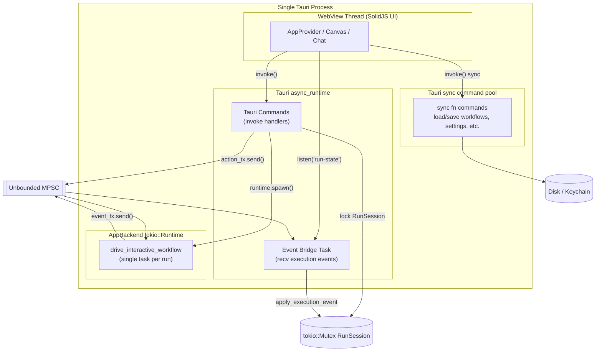
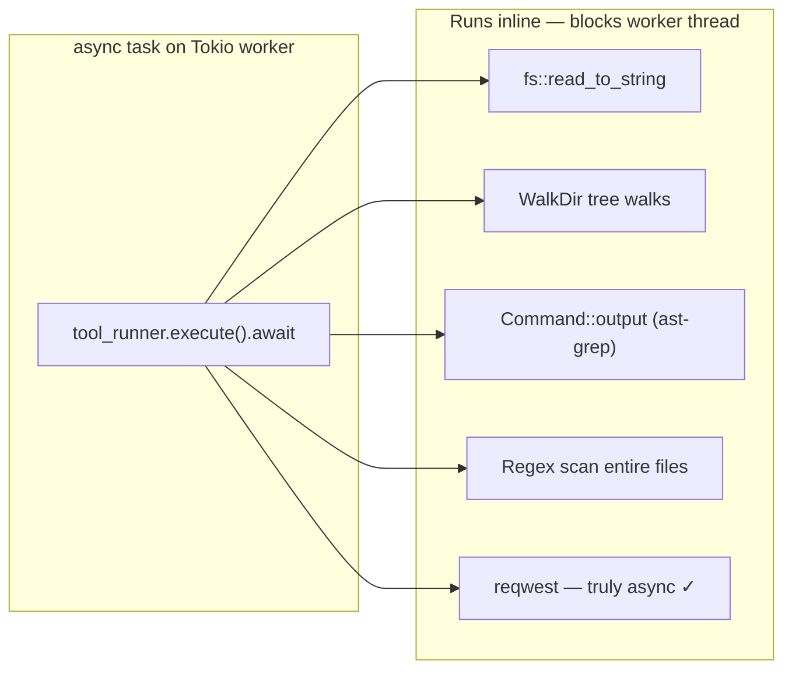
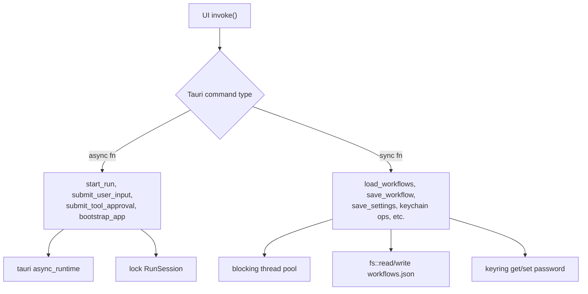
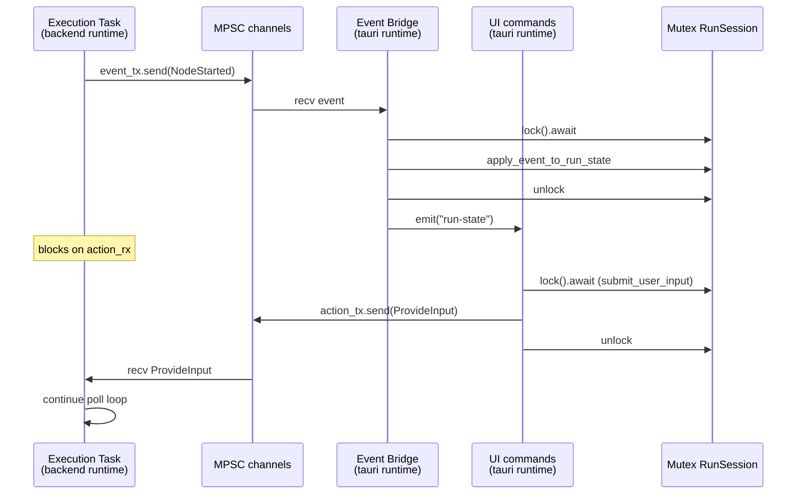
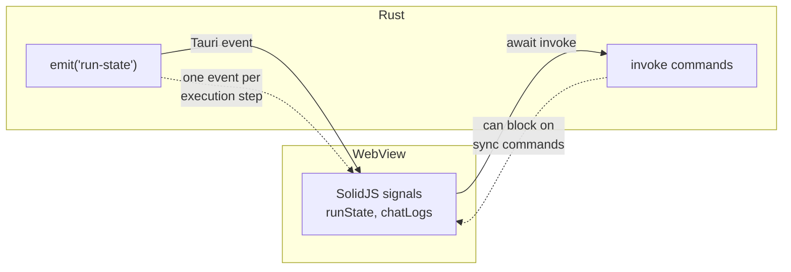
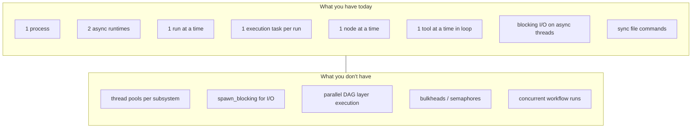

# Threading & Concurrency

How async tasks, runtimes, and I/O interact in Step-through-agentic-workflow — and where the current design creates risk or limits throughput.

Related: [architecture-contract.md](./architecture-contract.md)

## Executive summary

This app is **not heavily threaded**. It uses **async tasks on one or two Tokio runtimes**, with **one sequential execution loop** per workflow run. The main problems are:

1. **Two separate async runtimes** (AppBackend + Tauri) sharing state
2. **Blocking I/O on async worker threads** (no `spawn_blocking`)
3. **Fully sequential workflow execution** (DAG layers exist but are not parallelized)
4. **A single global mutex** around all run state
5. **Many sync Tauri commands** doing filesystem/keychain I/O on the command thread pool

There are no OS thread pools, no bulkheads, and no `spawn_blocking` anywhere in the codebase.

---

## Process & runtime topology

Everything runs in **one Tauri desktop process**. Inside it, concurrency is split awkwardly:



### Where each runtime lives

| Component | Runtime | File |
| --- | --- | --- |
| Workflow execution task | `AppBackend.runtime` | `crates/orchestration/src/backend.rs` |
| Tauri commands + event fanout | `tauri::async_runtime` | `crates/desktop/src/lib.rs` |
| Sync file commands | Tauri blocking pool | `crates/desktop/src/lib.rs` |

`AppBackend` creates its own runtime in `with_default_paths()` via `tokio::runtime::Runtime::new()`.

Workflow runs are spawned on that runtime in `spawn_interactive_workflow_run()` (`crates/orchestration/src/execution.rs`).

The event bridge runs on Tauri's runtime in `start_run()` (`crates/desktop/src/lib.rs`), which spawns a task on `tauri::async_runtime` to recv execution events, apply them to run state, and emit `run-state` to the UI.

### Issue: dual runtime, shared state

`RunSession` is a `tokio::sync::Mutex` touched from **both** runtimes:

- Execution task (backend runtime) — indirectly via channels
- `apply_execution_event`, `submit_user_input`, `submit_tool_approval` (Tauri runtime)

This works in practice today but is fragile. Tokio mutexes are meant for tasks on the **same** runtime. Cross-runtime sharing adds subtle deadlock/latency risk and makes reasoning harder.

**Recommendation direction:** Use one runtime (prefer Tauri's) or move execution onto Tauri's runtime and drop the private `Runtime` in `AppBackend`.

---

## Workflow execution model (one task, one loop)

Each run is a **single async task** with a **synchronous poll loop**. No parallelism inside a run.

```mermaid
stateDiagram-v2
    [*] --> PollEngine

    PollEngine --> CallAi: EnginePollResult::CallAi
    PollEngine --> AwaitInput: AwaitInput
    PollEngine --> AwaitTools: AwaitToolApproval
    PollEngine --> Done: Completed
    PollEngine --> Failed: Failed

    CallAi --> InvokeProvider: ai.invoke().await
    InvokeProvider --> PollEngine: engine.on_ai_complete()

    AwaitInput --> WaitUser: action_rx.recv().await
    WaitUser --> PollEngine: ProvideInput

    AwaitTools --> ToolLoop: for each tool_call
    ToolLoop --> SubagentLoop: openflow_call_subagent
    ToolLoop --> ApprovalWait: needs prompt
    ToolLoop --> ExecuteTool: tool_runner.execute().await
    SubagentLoop --> InvokeProvider: nested ai.invoke loop
    ApprovalWait --> WaitApproval: action_rx.recv().await
    ExecuteTool --> ToolLoop
    WaitApproval --> ToolLoop
    ToolLoop --> PollEngine: engine.on_tool_results()

    Done --> [*]
    Failed --> [*]
```

The core loop lives in `drive_interactive_workflow()` (`crates/orchestration/src/execution.rs`). It calls `engine.poll()`, then awaits `ai.invoke()` or blocks on `action_rx` for user input and tool approvals.

### Issue: DAG layers are not parallelized

`execution_layers()` computes which nodes **could** run in parallel. `InteractiveEngine` still walks them **one at a time** via `layer_idx` / `node_idx` (`crates/domain/src/interactive.rs`).

Two independent nodes in the same layer still run serially. That is a throughput issue, not a correctness bug.

### Issue: subagents block the whole run

Subagent execution is a **nested loop inside the same task**, sharing `ai`, `tool_runner`, and channels. A slow subagent blocks everything else in that run.

---

## Blocking I/O on async threads

There is **no** `spawn_blocking`, `rayon`, or dedicated I/O thread pool anywhere in the repo.

`ToolRunner::execute` is `async`, but most work is **synchronous**:



Examples from `crates/orchestration/src/tools/runner.rs`:

- `fs::read_to_string`, `fs::read_dir`, `fs::metadata` — sync
- `WalkDir` over large trees — sync
- `Command::new("ast-grep").output()` — sync subprocess wait
- `search()` — reads every file, regex every line — sync

### Impact

During a large `search` or `find` tool call:

1. The Tokio worker thread is **blocked**
2. The execution task cannot yield
3. Other tasks on that runtime (if any) stall
4. UI may feel sluggish if runtimes share thread pressure

`read_url` uses `reqwest` correctly (async). Local filesystem tools do not.

---

## Tauri command threading

Most commands are **synchronous `fn`**, not `async fn`:



Sync commands call straight into orchestration stores (`crates/orchestration/src/storage.rs`, `settings_store.rs`, `credential_store.rs`).

### Impact

- Saving workflows while a run is active competes for disk I/O on a blocking pool thread — usually fine, but large files can delay command responses.
- Keychain access in provider API key commands is sync and can be slow.
- UI awaits `invoke()` — long sync commands make the app feel frozen.

Only a handful of commands are `async fn`. The rest block a Tauri worker.

---

## Run session locking & channels

All run lifecycle state sits behind one mutex:



### Issues

| Issue | Detail |
| --- | --- |
| **Single mutex** | Every event apply + every user input + every approval contends on `run_session` |
| **Clone on hot path** | `apply_execution_event` clones full `Workflow` and `WorkflowRunState` each event |
| **Unbounded channels** | `unbounded_channel()` — fast event bursts can grow memory without backpressure |
| **Single active run** | New `start_run` aborts previous handle — no concurrent runs |

---

## UI ↔ backend boundary

The UI is single-threaded (SolidJS in WebView). It does not spawn threads. Concurrency pain shows up as **IPC latency** and **event delivery**:



`AppProvider` listens for `run-state` events and updates signals (`crates/ui/src/context/AppProvider.tsx`). Each execution step (node start, tool call, chat message) triggers a full state snapshot emit. High-frequency tool loops mean many serializations and IPC round-trips.

---

## Declared but unused concurrency controls

`ToolConcurrency::Exclusive` exists in the domain model (`crates/domain/src/tools.rs`) but every tool is registered as `Shared` and nothing enforces exclusivity.

No semaphore, no per-tool mutex, no bulkhead.

---

## Issue severity matrix

| Priority | Issue | Symptom |
| --- | --- | --- |
| **P0** | Blocking fs/subprocess in async tool runner | UI stalls during search/find/ast-grep on large repos |
| **P0** | Dual Tokio runtimes sharing `RunSession` | Hard-to-debug latency, future deadlock risk |
| **P1** | Sequential node execution despite DAG layers | Slow multi-branch workflows |
| **P1** | Sync Tauri commands for all persistence | Invoke hangs on save/load during heavy I/O |
| **P2** | Subagents in nested loop, same task | Parent node frozen while subagent runs |
| **P2** | Unbounded event channel | Memory growth on chatty runs |
| **P3** | `ToolConcurrency::Exclusive` unused | Schema suggests safety that does not exist |

---

## Recommended directions (not implemented)

These are architectural options, not a mandate.

### A. Unify on one runtime

- Drop `AppBackend.runtime`; spawn execution on `tauri::async_runtime`
- Or use `Handle::current()` from Tauri in tests

### B. Move blocking work off async workers

```rust
// Pattern to adopt in ToolRunner
tokio::task::spawn_blocking(move || {
    // fs, WalkDir, Command::output
})
.await?
```

### C. Parallelize independent nodes

- Within a layer, `join!` / `FuturesUnordered` for nodes with satisfied upstream deps
- Requires per-node state isolation and careful event ordering

### D. Async persistence commands

- Convert sync `fn` Tauri handlers to `async fn`
- Use `tokio::fs` or `spawn_blocking` for file stores

### E. Backpressure on events

- Replace `unbounded_channel` with `bounded_channel(N)`
- Or batch events before emit to reduce IPC churn

### F. Enforce tool concurrency

- Per-tool `tokio::sync::Semaphore` for `Exclusive` tools
- Cap concurrent provider calls

---

## Mental model



---

## Key file reference

| Concern | File |
| --- | --- |
| Private Tokio runtime + `RunSession` mutex | `crates/orchestration/src/backend.rs` |
| Execution loop + spawn | `crates/orchestration/src/execution.rs` |
| Sequential engine | `crates/domain/src/interactive.rs` |
| Blocking tool I/O | `crates/orchestration/src/tools/runner.rs` |
| Sync file persistence | `crates/orchestration/src/storage.rs`, `settings_store.rs` |
| Tauri command + event bridge | `crates/desktop/src/lib.rs` |
| UI event listener | `crates/ui/src/context/AppProvider.tsx` |
